# React
- 从入门到精通
----
- [React 官网](https://zh-hans.reactjs.org/)
- 学习资源
    - 【幕课】React16.4 开发简书项目 从零基础入门到实战
    - [【BiliBili】React教程_React router4.x Antd Flux入门实战视频教程 【2018.12.17】](https://www.bilibili.com/video/BV1yt411e7NB)
    - 10-React 从入门到精通 【实战进阶45讲】【极客时间】【完结】
        - 源码 [react-geek-time - CodeSandbox](https://codesandbox.io/s/6n20nrzlxz?file=/src/c04/SnapshotSample.js)

- 后台模版
    - [Ant Design Pro 后台模版 - 是一个企业级中后台前端/设计解决方案](https://pro.ant.design/docs/getting-started-cn)
    - [Awesome dashboards - 后台模版集合 与 它们的技术栈](https://github.com/omarkdev/awesome-dashboards)

- 目录
    - [第1章 React基础](#第1章-React基础)
        - [1-1 React出现的历史背景及特性介绍](#1-1-React出现的历史背景及特性介绍)
            - [Flux架构：单向数据流](#Flux架构-单向数据流)
            - []()
            - []()
        - [1-2 以组件方式考虑UI的构建](#1-2-以组件方式考虑UI的构建)
            - [将 UI 组织成组件树的形式](#将-UI-组织成组件树的形式)
            - [何时创建组件：单一职责原则](#何时创建组件：单一职责原则)
            - [代码的抽象三原则 - 阮一峰](#代码的抽象三原则---阮一峰)
                - [一、DRY原则](#一、DRY原则)
                - [二、YAGNI原则](#二、YAGNI原则)
                - [三、Rule Of Three原则 / 三次原则](#三、Rule-Of-Three原则--三次原则)
            - [受控组件 && 非受控组件](#受控组件-&&-非受控组件)
        - [1-3 JSX 的本质不是模板引擎，而是语法糖](#1-3-JSX-的本质不是模板引擎，而是语法糖)
            - []()
            - []()
        - [1-4 React组件的生命周期及其使用场景](#1-4-React组件的生命周期及其使用场景)
            - [React 生命周期函数](#React-生命周期函数)
        - [1-5 理解 Virtual DOM 及 key 属性的作用](#1-5-理解-Virtual-DOM-及-key-属性的作用)
            - [Virtual DOM 是如何工作的](#Virtual-DOM-是如何工作的)
        - [1-6 组件设计模式 高阶组件和函数作为子组件](#1-6-组件设计模式-高阶组件和函数作为子组件)
        - [1-7 理解新的 Context API 及其使用场景](#1-7-理解新的-Context-API-及其使用场景)
        - [1-8 使用脚手架工具创建 React 项目](#1-8-使用脚手架工具创建-React-项目)
        - [1-9 打包和部署](#1-9-打包和部署)
    - [第2章 React初探](#第2章-React初探)
        - [1.环境搭建](#1环境搭建)
        - [2.React 组件分类](#2React-组件分类)

    - [第3章 React基础精讲](#第3章-React基础精讲)
    - [第4章 React高级内容](#第4章-React高级内容)
    - [第5章 Redux入门](#第5章-Redux入门)
        - [redux-使用总揽](#redux-使用总揽)
        - [Redux 主要API | Redux 设计和使用的三项原则](#5-9-redux知识点复习补充)
        - [5-1 Redux概念简述](#5-1-Redux概念简述)
        - [5-2 Redux的工作流程](#5-2-Redux的工作流程)
        - [5-3 Antd 使用入门]()
        - [5-4 创建redux中的store](#5-4-创建redux中的store)
        - [5-5 Action和Reducer的编写](#5-5-Action和Reducer的编写)
        - [5-7 ActionTypes的拆分](#5-7-ActionTypes的拆分)
        - [5-8 使用actionCreator统一创建action](#5-8-使用actionCreator统一创建action)
        - [5-9 Redux知识点复习补充](#5-9-Redux知识点复习补充)
    - [第6章 Redux进阶](#第6章-Redux进阶)
        - [6-1 UI组件和容器组件](#6-1-UI组件和容器组件)
        - [6-2 无状态组件](#6-2-无状态组件)
        - [6-3 Redux 中发送异步请求获取数据](#6-3-Redux-中发送异步请求获取数据)
        - [6-4 使用Redux-thunk中间件实现ajax数据请求](#6-4-使用Redux-thunk中间件实现ajax数据请求)
        - [6-5 什么是Redux中间件](#6-5-什么是Redux中间件)
        - [6-6 Redux-saga中间件使用入门](#6-6-Redux-saga中间件使用入门)
        - [6-8 如何使用React-redux](#6-8-如何使用React-redux)
        - [React Redux 组件更新/渲染 原理 connect之mapStateToProps 看这篇就够了！比中文文档好用！](#React-Redux-组件更新/渲染-原理-connect之mapStateToProps-看这篇就够了！比中文文档好用！)
    - [第7章 项目实战：Header组件开发](#第7章-项目实战：Header组件开发)
    - [第8章 项目实战：首页开发](#第8章-项目实战：首页开发)
    - [第9章 项目实战：详情页面和登录功能开发](#第9章-项目实战：详情页面和登录功能开发)
    - []()
    - []()
----

- 目录
    - [3.React 创建组件、绑定属性（绑定class、绑定style）、引入图片、循环数组渲染数据](#3React-创建组件绑定属性绑定class绑定style引入图片循环数组渲染数据)
    - [4.React事件 方法、 React定义方法的几种方式 获取数据 改变数据 执行方法传值](#4React事件-方法-React定义方法的几种方式-获取数据-改变数据-执行方法传值)
        - [2.如何改变state的数据？](#2如何改变state的数据)
        - [3.如何改变state的数据？](#3改变this指向的三种方法)
        - [4.执行方法 function 如何传递参数？](#4执行方法-function-如何传递参数)
        - [性能优化: onClick 执行方法 如何传参？](#性能优化-onClick-执行方法-如何传参)
    - [5.React 键盘事件 表单事件 事件对象以及React中的ref获取dom节点 、React实现类似Vue的双向数据绑定](#5React-键盘事件-表单事件-事件对象以及React中的ref获取dom节点-React实现类似Vue的双向数据绑定)
        - 事件对象
        - 键盘事件
        - 表单事件
        - [ref获取dom节点](#ref获取dom节点)
        - React实现类似于vue双向数据绑定
    - [6.React表单详解 约束性和非约束性组件 input text checkbox radio  select  textarea  以及获取表单的内容](#6React表单详解-约束性和非约束性组件-input-text-checkbox-radio--select--textarea--以及获取表单的内容)
    - 07 React实现Todolist练习 （上）（15分21秒）
    - 08 React实现Todolist练习 Todolist 待办事项 已经完成 （中）（22分8秒）
    - 09 React的模块化以及封装Storage实现todolist 待办事项 已经完成事项 以及实现数据持久化（下）（13分10秒）
    - 10 React中的组件、父子组件、React props父组件给子组件传值、子组件给父组件传值、父组件中通过refs获取子组件属性和方法(34分3秒)

----

- # 第1章 React基础
    - ## 1-1 React出现的历史背景及特性介绍
        > React 是 FaceBook 在 2013年 时候 推出的一款前端开发框架
        - ### 1.传统 Web UI 开发的问题
            - 在 FaceBook 团队 使用传统前端技术(如 Jquery) 开发 如下图所示的功能 (新消息提醒的红点功能)，却一再出现BUG，如：
                - 当我有一条新消息来了的时候，红点上的数字并没有更新
                - 或者，当我已经点开了 新消息，但是页面上的红点依然存在
                - 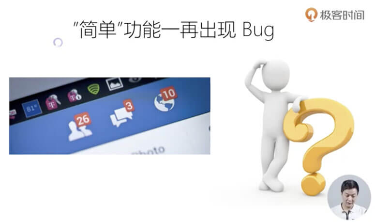
            - 于是 FaceBook 团队开始思考深层次的原因:
                - #### 问题出现的根源
                    - 1.传统 UI 操作关注太多细节
                        - 传统的 UI 操作需要了解很多 `DOM API` 才能实现 功能，如: `.attr(), .addClass(), .height(), .each(), .children() ... 等`
                    - 2.应用程序状态分散在各处，难以追踪和维护
        - ### 2.React 始终总体刷新刷新页面, 无需关心细节
            - 在传统前端技术中，如果 来了一条新消息，要更新页面，通常我们要走下面的流程
                - 1.首先要知道哪条数据是新的
                - 2.然后通过 `DOM API` 将 新的消息 渲染到页面上
            - 在 React 中，不管是来了一条新消息，还是2条, 3条 ... 逻辑都是一样的：
                - 只要 React 发现前后两个状态变了，相应的 UI 也会发生变化，React 会自动帮你做更新 UI 的操作
                - 这样的话，就能把你从 复杂的 UI操作 中解放出来，你只需要去关心 `状态` 和 `最终UI长成什么样`
            - 
        - ### 3.Flux架构：单向数据流
            - #### 数据模型如何解决？
                - 在传统 MVC 架构中，`Model` 和 `View` 是相互影响，双向绑定的
                - 这就导致了，当出现问题时，难以定位问题，你不知道是 `Model` 发生了问题，还是 `View` 发生了问题
                - 而且 传统 MVC 难以扩展和维护
                - 
            - #### Flux架构: 单向数据流
                - 所以 FaceBook 团队 提出了 `Flux架构`
                - 注意：Flux 不是一个完整的技术实现，而是一个设计模式，它的 核心思想就是 `单向数据流`
                - 
            - #### Flux架构衍生的项目: `React` 和 `MobX`

            - #### `Redux = Reducer + Flux`
                - 在 2013年 React 开源的时候，FaceBook 除了放出 React 之外，还放出了最原始的 **`Flux`** 这个辅助 React 使用的 数据层框架，后来才慢慢的被 优化升级成了 Redux

        - ### 4.React 很简单
            - 1.一个新概念：组件
            - 2.四个必须的API
            - 3.单向数据流
            - 4.完善的错误提示：在 console 面板上提示

    - ## 1-2 以组件方式考虑UI的构建
        - ### 将 UI 组织成组件树的形式
            - 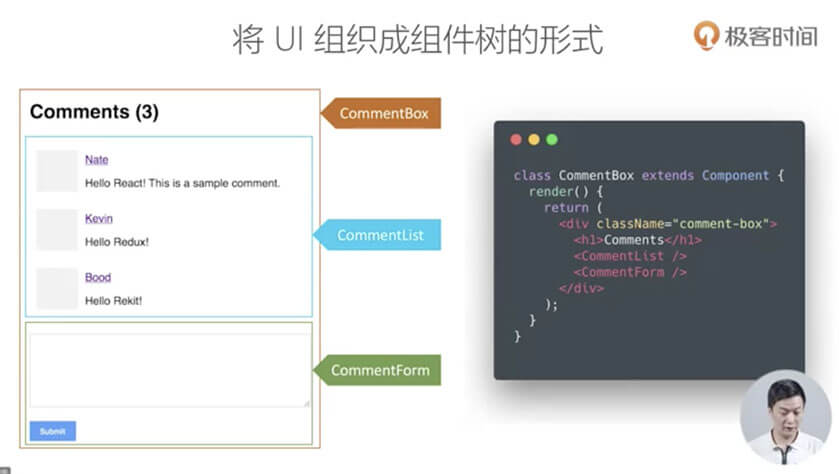
        - ### 什么是 React 组件呢？
            - 就是，由 `Props 属性` 和 `State 状态`, 最终得到一个 `view`
            - 1.React组件一般不提供方法，而是某种状态机。（你的状态是什么，它的结果一定是什么）
            - 2.React组件可以理解为一个 `纯函数`
            - 3.单向数据绑定
            - 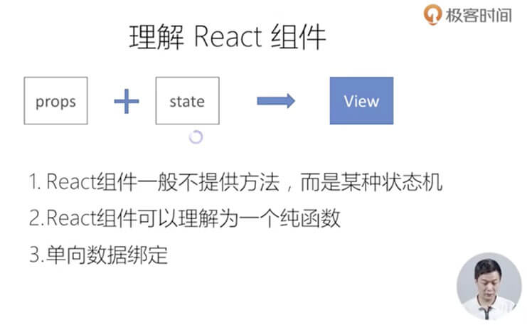
        - ### 创建一个简单的组件: tabSelect
            - 1.静态UI长成什么样？
            - 2.考虑组件的状态组成：它的状态是来自外部，还是需要在内部去维护
            - 3.考虑组件的交互方式：内部用户执行的一些操作，如何暴露出去给外部的人去使用？
            - 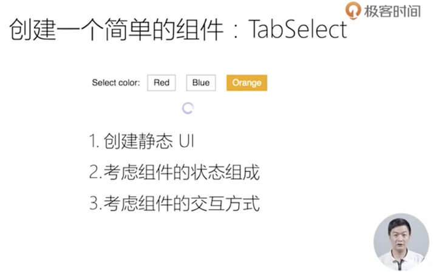
            ```js
            // TabSelector.js 组件

            import React, { PureComponent } from 'react'
            import PropTypes from 'prop-types'
            import './TabSelector.css'

            export default class TabSelector extends PureComponent {
                static PropTypes = {
                    value: PropTypes.string,
                    options: PropTypes.array,
                    onChange: PropTypes.func
                }

                static defaultProps = {
                    value: null,
                    options: [],
                    onChange: () => {}
                }

                render () {
                    const { options, value, onChange } = this.props
                    return (
                        <div className='tab-selector'>
                            <ul>
                                {options.map(opt => (
                                    <li
                                        key={opt.value}
                                        className={`tab-item ${
                                            opt.value === this.props.value
                                                ? 'selected'
                                                : ''
                                        }`}
                                        onClick={() => this.props.onChange(opt.value)}
                                    >
                                        {opt.name}
                                    </li>
                                ))}
                            </ul>
                        </div>
                    )
                }
            }
            ```
            ```js
            // 外部调用 TabSelector.js 组件

            import TabSelector from './TabSelector.js'

            const options = [
                { name: 'Red', value: 'red' },
                { name: 'Blue', value: 'blue' },
                { name: 'Orange', value: 'orange' },
            ]

            export class TabSelectorSample extends PureComponent {
                state = { color: null }
                render () {
                    return (
                        <div>
                            Select color:{' '}
                            <TabSelector
                                options={options}
                                value={this.state.color}
                                onChange={c => this.setState({ color: c})}
                            />
                        </div>
                    )
                }
            }
            ```
        - ### `受控组件` && `非受控组件`
            - react 中，有 `受控组件` && `非受控组件` 的概念
            - 应用范围比较小，主要针对 form 的元素
            - #### 受控组件
                - 受控组件 至少有两个属性: `value` 和 `onChange`
                - value 到底显示什么，取决于外面的属性，而不是 用户的输入
                - 不管用户输入什么，如果没有告诉 input 发生了变化，那么 value 是不会变化的
                - `受控组件 它的状态 是由外部维护的`
            - #### 非受控组件
                - `受控组件 它的状态 是由DOM自身维护的`
                - 用户输入什么，就显示什么
                - 如果你要拿到 非受控组件 的值，你就要知道它的 原生 `DOM node` 是什么
            - 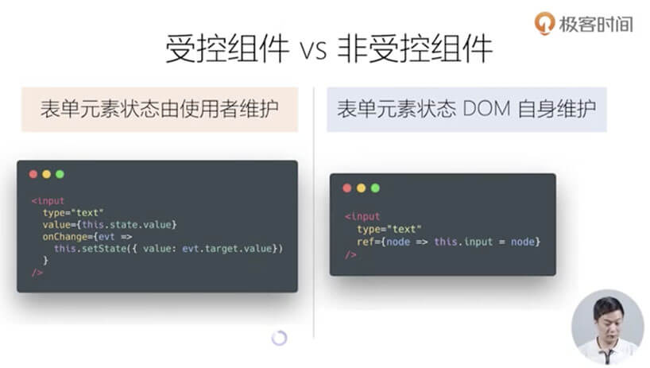
        - ### 何时创建组件：单一职责原则
            - 1.每个组件只做一件事情
            - 2.如果组件变得复杂，那么应该拆分成小组件
            - 3.把复杂度分散出去，每个组件只做自己的事情
            - 组件拆分的好处：
                - 如果一个组件很大的时候，任何一个状态变化，你整个组件都要重新刷新
                - 如果拆分成小组件，那么 如果其中某些小组件状态没发生变化，那么这些小组件 就都不需要进行刷新


        - ### 数据状态管理: DRY原则
            - 1.能计算得到的状态，就不要单独存储
            - 2.组件尽量无状态，所需数据通过props获取
                - 这样的话，**`就更容易让你的组件 是一个纯组件，拥有更好的性能，更容易被重用`**
        - ### [代码的抽象三原则 - 阮一峰](http://www.ruanyifeng.com/blog/2013/01/abstraction_principles.html)
            - #### 一、DRY原则
                - DRY是 Don't repeat yourself 的缩写，意思是"不要重复自己"。
                - 软件工程名著 `《The Pragmatic Programmer》实用主义程序员`首先提出了这个原则。
                - 它的涵义是，系统的每一个功能都应该有唯一的实现。也就是说，如果多次遇到同样的问题，就应该抽象出一个共同的解决方法，不要重复开发同样的功能。
                - 这个原则有时也称为"一次且仅一次"原则（Once and Only Once）。
            - #### 二、YAGNI原则
                - YAGNI是 You aren't gonna need it 的缩写，意思是"你不会需要它"。
                - 这是 `《Extreme Programming》"极限编程"` 提倡的原则，指的是你自以为有用的功能，实际上都是用不到的。因此，除了最核心的功能，其他功能一概不要部署，这样可以大大加快开发。
                - 它背后的指导思想，就是尽可能快、尽可能简单地让软件运行起来（do the simplest thing that could possibly work）。
                - 但是，这里出现了一个问题。仔细推敲的话，你会发现DRY原则和YAGNI原则并非完全兼容。前者追求"抽象化"，要求找到通用的解决方法；后者追求"快和省"，意味着不要把精力放在抽象化上面，因为很可能"你不会需要它"。所以，就有了第三个原则。
            - #### 三、Rule Of Three原则 / 三次原则
                - `Rule of three` 称为 `"三次原则"`，指的是当某个功能第三次出现时，才进行"抽象化"。
                - 这是软件开发大家 `Martin Fowler` 在 `《Refactoring》重构` 一书中提出的。
                - 它的涵义是
                    - 第一次用到某个功能时，你写一个特定的解决方法；
                    - 第二次又用到的时候，你拷贝上一次的代码；
                    - 第三次出现的时候，你才着手"抽象化"，写出通用的解决方法。
                - 这样做有几个理由：
                    - 1）省事。如果一种功能只有一到两个地方会用到，就不需要在"抽象化"上面耗费时间了。
                    - 2）容易发现模式。"抽象化"需要找到问题的模式，问题出现的场合越多，就越容易看出模式，从而可以更准确地"抽象化"。
                        - 比如，对于一个数列来说，两个元素不足以判断出规律：
                            - ```1, 2, _, _, _, _,```
                        - 第三个元素出现后，规律就变得较清晰了：
                            - ```1, 2, 4, _, _, _,```
                    - 3）防止过度冗余。如果一种功能同时有多个实现，管理起来非常麻烦，修改的时候需要修改多处。在实际工作中，重复实现最多可以容忍出现一次，再多就无法接受了。
                - 综上所述，"三次原则"是DRY原则和YAGNI原则的折衷，是代码冗余和开发成本的平衡点，值得我们在"抽象化"时遵循。

    - ## 1-3 JSX 的本质不是模板引擎，而是语法糖
        - ### JSX的本质: 动态创建组件的语法糖
            - JSX: 在 JavaScript 代码中直接写 HTML 的标记
                > 这也是 React 在刚刚推出的时候，最受争议的一点: <br>
                > "你怎么把 UI 的描述放到了代码中?"
            - 在传统前端技术中，我们知道
                - 我们除了可以用 **`HTML`** 来描述一个 DOM 节点，我们还可以用
                - **`JavaScript DOM Api`**
                    - `document.createElement` 来创建一个 原生的 DOM 节点
                    - 而 JSX 就是对于 `JavaScript DOM Api` 再次封装的 **`语法糖`**
        - ### 来看两个 JSX 的例子
            ```js
            const name = 'Josh Perez'
            const element = <h1>Hello, {name}</h1>
            

            // 上面的代码，完全等价于下面的代码


            const name = 'Josh Perez'
            const element = React.createElement({
                'h1',           // 标记的类型
                null,           // 标记的属性
                'Hello, ',      // 第三个参数开始，后面都是 它的子元素
                name
            })
            ```
            - 再来看个更复杂一点的例子
            ```js
            class CommentBox extends React.Component {
                render () {
                    return (
                        <div className='comments'>
                            <h1>Comments ({this.state.items.length})</h1>
                            <CommentList data={this.state.items} />
                            <CommentForm />
                        </div>
                    )
                }
            }
            ReactDOM.render(<CommentBox topicId='1' >, mountNode)
            ```
            - 上面的代码，完全等价于下面的代码
            ```js
            class CommentBox extends React.Component {
                render () {
                    return React.createElement(
                        'div',
                        { className: 'comments' },
                        React.createElement(
                            'h1',
                            null,
                            'Comments (',
                            this.state.items.length,
                            ')'
                        ),
                        React.createElement(CommentList, {data: this.state.items}),
                        React.createElement(CommentForm, null)
                    )
                }
            }

            ReactDOM.render(
                React.createElement(CommentBox, {topicId: '1' }),
                mountNode
            )
            ```
        - ### JSX的优点
            - 利用了 JavaScript 的原生语法，而不是发明了一种模版语言
                - 在其他框架、或者传统模式下，我们要额外学习一门模版语言，来描述你 UI 的变量，或者 格式化函数 ...等
                - 但是在 React 中，JSX 并不是一门模版语言，而是 `纯JavaScript` , 只是换了一种写法
                - 这样的话，就能让我们利用到 JavaScript 所有本身的特性，来做一些 `动态创建UI的事情`
            - 1.声明式创建界面的直观
            - 2.代码动态创建界面的灵活
            - 3.无需学习新的模版语言
        - ### [JSX的缺点](https://www.zhihu.com/question/48528161)
            > Facebook 早年有一个叫 XHP 的技术，可以在 PHP 代码里写 HTML，有这样的传统 React 搞出 JSX 就不稀奇了。
        - ### JSX 的约定
            - 1.React 认为小写的tag是原生 DOM 节点，如 `<div>`
            - 2.大写字母开头为自定义组件, 如` <Greeting />`
            - 3.JSX 标记可以直接使用属性语法，例如 `<menu.item />`
                - 如果是使用 `.` 属性语法的话，就不需要遵循 大写字母开头的约定

        - ### 在 JSX 中使用表达式
            > 唯一特别的是，在 JSX 中的表达式 要写在 `{}` 大括号内
            - 1.JSX 本身就是表达式
                ```js
                const element = <h1>Hello World</h1>
                ```
            - 2.在属性中使用表达式
                ```js
                <Mycomponent foo={1 + 2 + 3 + 4} />
                ```
            - 3.延展属性
                ```js
                const props = {firstName: 'Ben', lastName: 'Hector'}
                const greeting = <Greeting {...props} />
                ```
            - 4.表达式作为子元素
                ```js
                const element = <li>{props.message}</li>
                ```
        - ### 对比 Angular 模版语法
            - 要在 HTML 模版中 给它写一些 `特殊的属性`
            - 然后 `需要解释器` 来解释这些属性
            - 最终来重新组织我们的 UI
            > 其他模版语言 是需要你去学习一些 新的语法的<br>
            > 而 JSX 不需要
            - 


    - ## 1-4 React组件的生命周期及其使用场景
        - [react 生命周期图 在线 各版本 各语言: https://projects.wojtekmaj.pl/react-lifecycle-methods-diagram/](https://projects.wojtekmaj.pl/react-lifecycle-methods-diagram/)
        - 
        - 
        - 什么是 commit ?
            - commit 就是 react 把当前的状态，映射到 DOM 的时候
            - 它需要 实际的去更新 DOM 节点
            - 更新 DOM 节点 就称之为 commit
        - **`Pre-Commit`** 阶段
            - Pre-Commit 阶段，还没真正的更新 DOM
            - 但是 在这个阶段是 **`可以读取 DOM 的内容的`**
        - **`Commit`** 阶段
            - DOM 已经被更新了

        - [React v16.3之后的组件生命周期函数](https://zhuanlan.zhihu.com/p/38030418)
            - React v16.3虽然是一个小版本升级，但是却对React组件生命周期函数有巨大变化
        ```
        生命周期函数

            - 装配 / 初始化
                constructor
                static getDerivedStateFromProps
                componentWillMount / UNSAFE_componentWillMount
                render
                componentDidMount

            - 更新 / 组件重新渲染
                componentWillReceiveProps / UNSAFE_...
                static getDerivedStateFromProps
                shouldComponentUpdate
                componentWillUpdate / UNSAFE_...
                render
                getSnapshotBeforeUpdate
                componentDidUpdate

            - 卸载
                componentWillUnmount
        ```
        ```js
        class App extends react.Component {

            // 首先被执行
            constructor (props) {}

            // 准备：即将被加载
            componentWillMount () {} // UNSAFE

            // 渲染中
            render()

            getSnapshotBeforeUpdate(prevProps, prevState) {}

            // 已插入真实DOM
            componentDidMount() {}

            // 准备：即将被重新渲染，状态未变化
            componentWillUpdate(nextProps, nextState) {} // UNSAFE

            // 完成：正在被重新渲染，状态已变化
            componentDidUpdate(prevProps, prevState, snapshot) {}

            // 已加载组件，收到新属性时调用
            componentWillReceiveProps(nextProps) {} // UNSAFE

            // 组件将被卸载
            componentWillUnmount() {}

            shouldComponentUpdate(nextProps, nextState) {}
        }
        ```
        ```js
        React 更新方式：
            - 1.setState
            - 2.forceUpdate // 强制更新
                - react强制重新渲染: 在react中，state和props数据更新，就会重新render，但是当层级过深时，可能就不会触发渲染，这时候就要用到 this.forceUpdate();

            - 3.父组件更新，会带动 子组件更新
                - 如：父组件 App 下面有个 Text子组件，如果 父组件更新，子组件也会跟着更新
        ```

        - `constructor`
            - 1.用于初始化内部状态，很少使用
            - 2.唯一可以直接修改 state 的地方
        - `getDerivedStateFromProps`
            - react v16.3 版本 新加的 生命周期函数, 用来取代 原来的 componentWillReceiveProps
            - 1.当 state 需要从 props 初始化时使用
            - 2.尽量不要使用：维护两者状态的一致性，会增加复杂度
                - 如果你的 state 需要从 props 获得，一般来说 都可以从 props 动态计算得到
                - 因为如果 一旦你需要单独存储 state, 那么就意味着 你需要始终 维护 两者的一致性, 而维护这种 一致性 会增加很多的 复杂度, 容易增加 BUG
            - 3.每次 render 都会调用
            - 4.典型场景: 表单控件获取默认值 (初始化时的默认值)
        - `componentDidMount`
            - 1.UI 渲染完成后调用
            - 2.只执行一次
            - 3.典型场景: 获取外部资源
        - `componentWillUnmount`
            - 1.移除组件时调用
            - 2.典型场景: 资源释放
        - `getSnapshotBeforeUpdate`
            - 1.在页面 render 之前调用, state 更新
            - 2.典型场景: 获取 render 之前的 DOM 状态

    - #### React 生命周期函数
        ```js
        componentWillReceiveProps (nextProps) {
            if (nextProps.attendanceStatusList !== this.state.attendanceStatusList) {
                console.log('参数变化了 ', nextProps.attendanceStatusList);
                this.setState({ attendanceStatusList: nextProps.attendanceStatusList })
            }
        }

        componentDidUpdate(prevProps) {
            // 每次打开弹窗时 设置焦点
            if (prevProps.model.modelObj.addGuestModalVisible != this.props.model.modelObj.addGuestModalVisible && this.props.model.modelObj.addGuestModalVisible) setTimeout(() => { this.guestName.input.focus() }, 150)
        }
        ```

    - ## 1-5 理解 Virtual DOM 及 key 属性的作用
        - 小结在前
            - 1.算法复杂度为 O(n)
            - 2.虚拟 DOM 如何计算 diff
            - 3.key 属性的作用
        - ### Virtual DOM: JSX 的运行基础
            - 1.React 组件 在其内部维护了一套 `虚拟DOM 的状态`
                - 这套 DOM 的状态，最终会映射到 真实的DOM 节点上，
                - 当 虚拟DOM 状态发生变化时，它需要 计算 变化前后两套 虚拟DOM 的区别，来产生一个 Diff
                - 最终在真实的 DOM 节点上，**`并不是真正的 整体刷新所有的DOM`**
                - 而是 只会把这个 Diff 的部分，用一种高效的方式 去更新到 UI 上，**`从而能够保证性能`**
        - ### Virtual DOM 是如何工作的
            - 
            - 变化：顺序的变化、层次的变化
            - 这个场景下，我们就需要做一些 **`局部的更新`**
            - 我们要 **`让程序自动去做这个事情`**，不需要让 用户去关心这些细节，不需要手动的去做这些事情, 这是一个非常大的挑战
                - > 因为 做两个 tree 的 diff , 它的标准算法 的复杂度 **`O(n³)`**
                - 这个算法复杂度是非常高的
                - 如果你在 浏览器 去运行计算 这么高的复杂度 的计算，那么就一定会 造成性能问题
            - FaceBook 工程师 **`针对 UI 更新的特点，来进行算法的优化`**
                - 最终能够把这个 DOM Diff 算法复杂度 降低到了 **`O(n)`**, 是一个非常 巨大的提升
        - ### 那么 他究竟做了什么优化，来实现这么一个 高性能的算法呢？
            - 
            - #### 广度优先分层比较
                - 拿到两个 DOM树 之后，是一层一层的比较
                - 我们 先来看 上面这个图中，前后 两棵 DOM树 的区别
                    - 1.A B节点 顺序发生了变化
                    - 2.D节点 位置发生了变化
                    - 3.A节点的子节点G，由原来的圆形，变成了 方形，意思是 组件类型 发生了变化
                - #### 那 针对这些 不同的变化，React 的 Diff 算法是有不同的处理方式
                    - 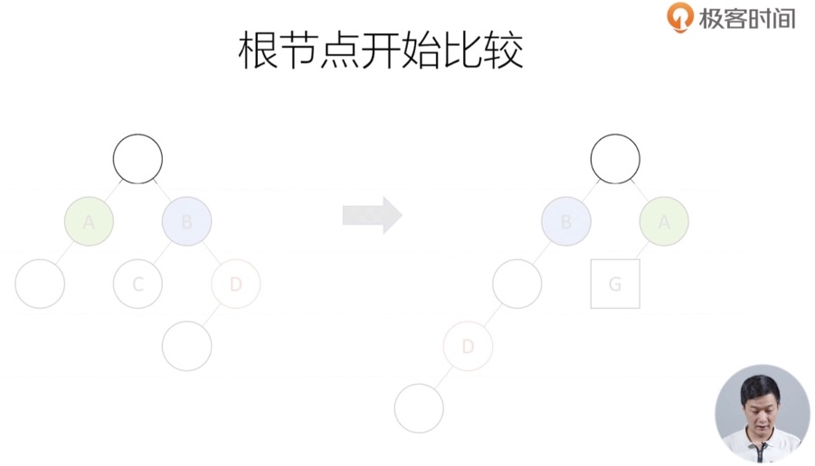
                    - #### 1.从 根节点开始比较
                    - 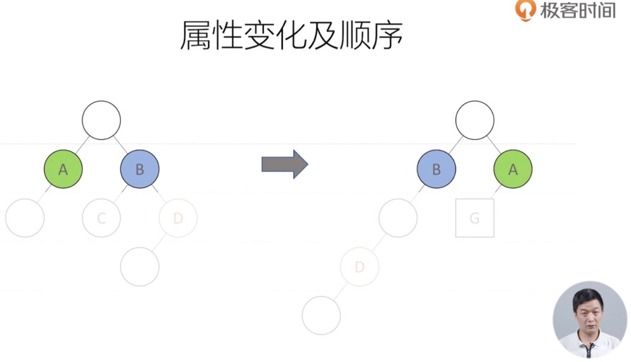
                    - #### 2.顺序发生了变化
                        - 交换两个节点的位置
                            - 对于我们 来说，顺序发生了变化，我们只需要 将他们 交换一下顺序就可以了
                            - 但是，对于计算机来说，如果要交换他们的顺序，就要知道它们的 **`唯一标识`**
                                - 而且，计算机 要知道 节点的顺序，首先也要先 按照 **`唯一标识`** 记录下它们的顺序，用来和 变化后的 tree 来对比，才知道 是否发生了变化
                    - 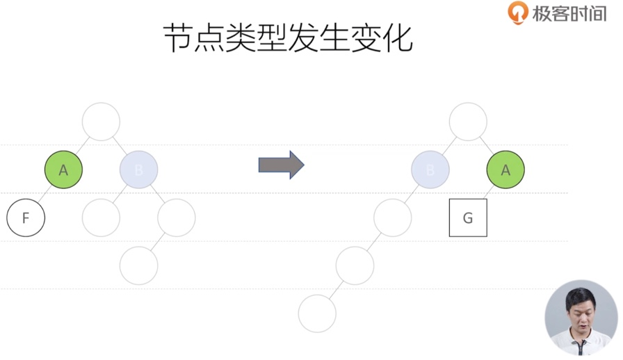
                    - #### 3.节点类型发生变化
                        - A 下面的 F节点，变成了 G节点
                            - 当 React 遇到这种 情况的时候，
                            - 它会 **`直接把 F节点 删除`**，然后 创建一个新的 G节点，然后 append 到 A节点下面
                        - > 它 不会去管，你这个 F节点 是否被其他地方 用到 （React 不会去做这些检查），它 只会简单的把 F删掉 换成一个 G节点。(因为 去检查 会有额外的 计算量)
                    - 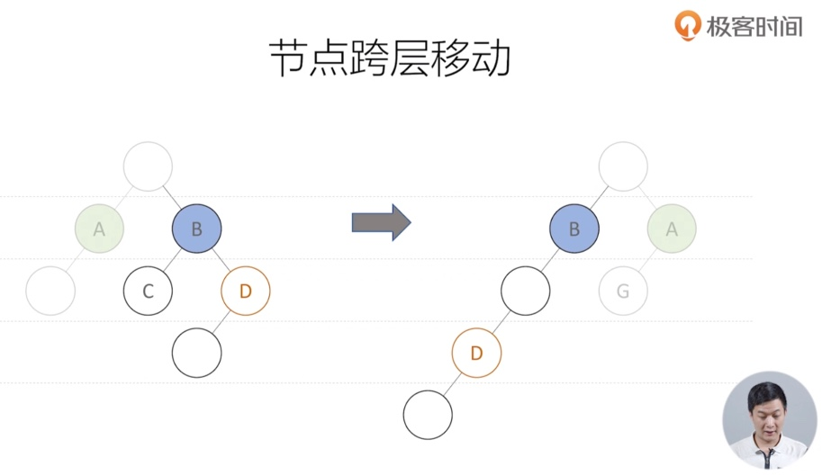
                    - #### 4.节点跨层移动
                        - 这是 react 核心优化的一种情况
                        - 例如：D节点 原来是 B的子节点，现在变成了 B节点 的 孙节点
                            - 这种情况下，我们如果是人工介入的话，我们是很容易知道，只要给 D节点 换一个 parent 就可以了
                        - 但是 对于 React diff 算法而言，它不会去 做这样的事情
                            - > 1.它只会知道 B 下面的 D节点 没有，然后就直接 去把 D节点 删掉，包括 D 节点 和 D节点 下面的所有子节点 都会被删除
                            - > 2.然后再往下走，发现 B节点 还有 一个 孙节点 D，然后再 创建新的 D节点，append 到 B节点 下
                        - 所以，当 节点进行跨层移动的时候，看上去 React 做的这个算法 性能是比较低的。因为它 只会去 把原来的 **`完全删除，然后再去 创建一个新的`**
                - > **`总结`**：Diff 算法，一层一层的比较下来，并不会去尝试做 更多的调查，你这个节点是否在 其它地方用到。这也是 它的性能 能够优化到 O(n) 的一个原因 
            - 那么，这么做 它到底会不会产生 性能的问题呢？
                - 我们在开发的过程中发现，这完全不会 带来性能的问题
                - 为什么呢？
                    - 因为 它针对的是 我们 UI 的特点，DOM结构 一般来说 是相对稳定的、
                    - UI 发生变化的时候，**`很少会发生 节点跨层移动 的情况`**
                    - 一般都是
                        - 1.顺序发生了变化
                        - 2.或者 属性 发生了变化
                        - 3.移除节点
                        - 4.重新创建
                    - 所以，针对这种 很少发生 的应用场景，react 选择直接放弃检查，其实是 完全合理的。因为它可以带来 一个全面的性能提升
        - #### 虚拟 DOM 的两个假设
            - 1.组件的 DOM 结构是 相对稳定的
            - 2.类型相同的兄弟节点 可以被唯一标识
            - 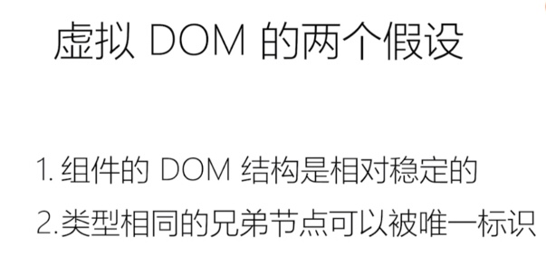
        - 当一个 同级兄弟节点，没有给 **`key值`** 时
            - 不仅仅会在 console 中 warning 提示
            - 有可能 在 DOM Diff 算法中，直接不做对比 (因为没有 唯一标识 的key值), 而是 做一些性能 开销更大 的行为
            - > 所以 key 值不只是 用来消除 warning，更多的是 提高性能 的方法
        - ### DOM Diff 简单示例
            - https://supnate.github.io/react-dom-diff/index.html
            - 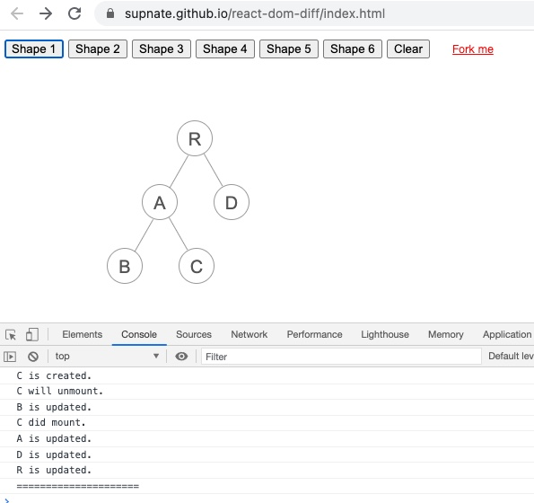
            - [源码 目录 下载](https://github.com/946629031/React/tree/main/react-dom-diff)


    - ## 1-6 组件设计模式 高阶组件和函数作为子组件
    - ## 1-7 理解新的 Context API 及其使用场景
    - ## 1-8 使用脚手架工具创建 React 项目
    - ## 1-9 打包和部署


- # 第2章 React初探
- ## 1.环境搭建
    - create-react-app 脚手架
        - `npm i create-react-app -g` 全局安装脚手架
        - `create-react-app --version` 查看版本
        - `create-react-app project-name` 创建项目
        - 创建项目时，会帮你下载依赖
            - 所以不用自己 `npm install` 安装依赖了
            - `cd project-name`
            - `npm start` 启动项目
            - `npm run build`
                - Bundles the app into static files for production
                - 将应用程序打包成静态文件用于生产
            - `npm run eject` 弹出配置文件，可以自定义配置 webpack
        - `npm i redux` 安装第三方库 redux

- ## 2.React 组件分类
    - 函数组件
        ```jsx
        import React from 'react'

        // 定义 函数组件
        fucntion tun (props) {
            return <div>骑兵连连长{props.boss}</div>
        }

        class Home extends React.Component {
            render () {
                return (
                    <div>标题</div>
                    <tun boss='孙德胜'></tun>
                )
            }
        }

        export default Home
        ```
    - class 组件
        ```jsx
        import React from 'react'
        import logo from '../assets/img/logo.svg'

        class Home extends React.Component {
            constructor (props) {   // 父子组件传值 , 接收props
                super(props)    // 固定写法

                this.state = {  // 组件数据
                    msg: '我是一个组件',
                    title: '我是一个title',

                    list: ['1111', '2222', '3333'],
                    list2: [
                        <h2 key='1'>我是一个h2</h2>,
                        <h2 key='2'>我是另一个h2</h2>,
                    ]
                }
            }

            render () {

                let listResult = this.state.list.map( (value, key) => {
                    return <li key={key}> {value} </li>
                } )

                return (
                    <div>
                        <h2>{this.state.msg}</h2>
                        <div title={this.state.title}>div</div> {/* 绑定属性 */}

                        
                        
                        

                        {/* for 数据循环 */}
                        {this.state.list2}
                        <ul>
                            {listResult}
                        </ul>
                        {this.state.list}
                    </div>
                )
            }
        }

        export default Home
        ```

- ## 3.React 创建组件、绑定属性（绑定class、绑定style）、引入图片、循环数组渲染数据
    > JSX 中 绑定属性注意
    - class 要换成 className
    - for 要换成 htmlFor
    - style
        ```html
        <div style={{'color': 'red'}}></div>
        <div style={{ 'color': this.state.color }}></div>
        ```
    - 引入图片的两种方式
        ```js
        {/* 第一种方式 */}
        import logo from '../assets/img/1.jpg'

        

        {/* 第二种方式 */}
        

        {/* 第三种方式  引入在线图片 */}
        
        ```
    - 数据循环
        ```js
        import React from 'react'

        class Home extends React.Component {
            constructor (props) {   // 父子组件传值 , 接收props
                super(props)    // 固定写法

                this.state = {  // 组件数据
                    list: ['1111', '2222', '3333'],
                    list2: [
                        <h2 key='1'>我是一个h2</h2>,
                        <h2 key='2'>我是另一个h2</h2>,
                    ],
                    list3: [
                        {title: '新闻 11111'},
                        {title: '新闻 22222'},
                        {title: '新闻 33333'},
                        {title: '新闻 44444'}
                    ]
                }
            }

            render () {

                let listResult = this.state.list.map( (value, key) => {
                    return <li key={key}> {value} </li>
                } )

                return (
                    <div>
                        {/* for 数据循环 方式一 */}
                        {this.state.list2}

                        {/* for 数据循环 方式二  先数据预处理  再展示 */}
                        <ul>
                            {listResult}
                        </ul>

                        {this.state.list}  {/* 这种写法 不能真正 数据循环 */}


                        {/* for 数据循环 方式三 */}
                        <ul>
                            {
                                this.state.list3.map( function(value, key){
                                    return ( <li key={key}> {value.title} </li> )
                                })
                            }
                        </ul>
                    </div>
                )
            }
        }

        export default Home
        ```

- ## 4.React事件 方法、 React定义方法的几种方式 获取数据 改变数据 执行方法传值
    - ### 1.定义 事件方法
        - 在 `constructor()` 和 `render()` 平级的地方，定义方法就行
            ```jsx
            import react from 'react'

            class News extends react.Component {
                constructor (props) {
                    super(props)

                    this.state = {
                        msg: '我是一个News组件'
                    }
                }

                {/* 定义方法 */}
                run(){
                    alert('这是一个方法')
                }

                render(){
                    return (
                        <div>
                            <h2>{this.state.msg}</h2>
                            <button onClick={this.run}>执行方法</button>
                            {/*
                            注意：
                                - 在 JSX 里调用方法的时候，在后面加 () 圆括号，是直接调用的意思
                                - 像这样，才是在监听 等待触发事件 触发后 才执行对应方法 `<button onClick={this.run}>执行方法</button>`
                            */}


                        </div>
                    )
                }
            }

            export default News
            ```
            
    - ### 2.如何改变state的数据？
        - 通过 `this.setState` 来改变 state 数据
        ```js
        import react from 'react'

        class SetData extends react.Component {
            constructor (props) {
                super(props)
                this.state = {
                    msg: 'this is msg'
                }
            }

            setData = () => {
                this.state.msg = '这是改变后的值2'  // 这种写法无效

                this.setState({     // 有效写法
                    msg: '这是改变后的值'
                })
            }

            render(){
                return (
                    <div>
                        <div>{this.state.msg}</div>
                        <button onClick= {this.setData}>改变 state 的数据</button>
                    </div>
                )
            }
        }

        export default SetData
        ```
    - ### 3.改变this指向的三种方法
        - 如何 读取组件中的数据？
        ```jsx
        import react from 'react'

        class News extends react.Component {
            constructor (props) {
                super(props)

                this.state = {
                    msg: '我是一个News组件',
                    message: '这是第二种 读取数据的方法',
                    name: '这是第三种 读取数据的方法'
                }

                // 第二种 获取数据 的方式
                this.getMessage = this.getMessage.bind(this) // constructor 里面的 this 指向 class 自身
                // console.log(this)
            }

            // 定义方法
            run () {
                alert('这是一个方法')
            }

            getData () {
                // this 指向 undefined
                alert(this.state.msg)   // TypeError: Cannot read property 'state' of undefined
            }

            // 第二种 通过 constructor 里面的 this，改变 this 指向
            getMessage () {
                alert(this.state.message)
            }

            // 第三种 读取数据的方法
            // 通过 箭头函数 this 指向外部上下文
            getName = () => {
                alert(this.state.name)
            }

            render () {
                return (
                    <div>
                        <h2>{this.state.msg}</h2>
                        <button onClick={this.run}>执行方法</button>
                        {/*
                        注意：
                            - 在 JSX 里调用方法的时候，在后面加 () 圆括号，是直接调用的意思
                            - 像这样，才是在监听 等待触发事件 触发后 才执行对应方法 `<button onClick={this.run}>执行方法</button>`
                        */}


                        {/* 注意：直接调用 this.state.msg 会报错 */}
                        <button onClick = {this.getData} >getData</button>

                        {/* 读取组件中的数据的 三种方法 */}
                        {/* 第一种 获取数据 的方式。通过 bind 改变this指向的方法 */}
                        <button onClick = {this.getData.bind(this)} >第一种 获取数据 的方式</button>

                        {/* 第二种 通过 constructor 里面的 this，改变 this 指向 */}
                        <button onClick = {this.getMessage} >第二种 获取数据 的方式</button>

                        {/* 第三种 通过 箭头函数 this 指向外部上下文 */}
                        <button onClick = {this.getName} >第三种 获取数据 的方式</button>

                        {/* 第四种 通过 onclick 中 再包含 箭头函数 */}
                        <button onClick = {() => this.getName()} >第三种 获取数据 的方式</button>
                    </div>
                )
            }
        }

        export default News
        ```
    
    - ### 4.执行方法 function 如何传递参数？
        - 通过 `bind` 方法来传参
        ```jsx
        import react from 'react'

        class GetParms extends react.Component {
            constructor (props) {
                super(props)
                this.state = {
                    username: '李四'
                }
            }

            getParms = (str, str2) => {
                this.setState({     // 有效写法
                    username: str + ' 和 ' + str2
                })
            }

            render(){
                return (
                    <div>
                        <div>{this.state.username}</div>
                        <button onClick= {this.getParms.bind(this, '张三', '王五')}>function 传参</button>
                    </div>
                )
            }
        }

        export default GetParms
        ```
        - ### 性能优化: onClick 执行方法 如何传参？
            - [render中bind](#https://juejin.cn/post/6844903892736557064)
            - 在 render 中直接bind。
            - onClick 执行方法 如何传参？
            - 因此总结下来如下：
            ```jsx
            render () {
                return (
                    <a onClick={this.clickEvent}>方法1 constructor绑定</a>
                    <a onClick={() => this.clickEvent()}>方法2 箭头函数绑定</a>
                    <a onClick={this.clickEvent.bind(this)}>方法3 直接绑定</a>
                )
            }
            ```
            - 性能对比:
                > 首先，官方推荐第一种方法绑定this。那么接下来我们分析一下：
                - 第一种方法，只在构造函数里面渲染一次，即实例化时执行一遍。
                - 第二种方法，每一次render的时候，都会生成一个新的箭头函数。
                - 第三种方法，每一次render的时候都会执行一次函数。

            - 参考链接
                - [render中bind](https://juejin.cn/post/6844903892736557064)
                - [如何将事件处理器（比如 onClick）传递给组件？](https://zh-hans.reactjs.org/docs/faq-functions.html)
                - [React组件优化](https://segmentfault.com/a/1190000016816130)
            
            - 方法1 constructor绑定
                ```jsx
                import react from 'react'
                class one extends react.Component {
                    constructor (props) {
                        super(props)
                        this.state = {
                            soldiers: ['虎子', '柱子', '王根生']
                        }
                        this.addsoldier = this.addsoldier.bind(this)  // 方法1 constructor绑定
                    }

                    addsoldier () {
                        console.log('add an other soldier')
                        this.setState({
                            soldiers: [...this.state.soldiers, '新兵蛋子']
                        })
                    }

                    render () {
                        return <div>士兵名：{this.state.soldiers[0]}</div>
                    }
                }
                ```

- ## 5. React 键盘事件、表单事件、事件对象、ref获取dom节点、React实现类似Vue的双向数据绑定
    - ### 事件对象
        - 在触发DOM上的某个事件时，会产生一个 **`事件对象 event`**。这个对象包含着所有与事件有关的信息
        ```jsx
        import react from 'react'

        class Event extends react.Component {
            constructor (props) {
                super(props)
                this.state = {
                    msg: '事件对象演示'
                }
            }

            run = (event) => {  // 获取 event 对象
                console.log(event);
                console.log(event.target)

                event.target.style.background = 'red'      // 改变css
                let aid = event.target.getAttribute('aid') // 获取节点属性值
            }

            render(){
                return (
                    <div>
                        <div>{this.state.msg}</div>
                        <button onClick= {this.run} aid='8899'>事件对象</button>
                    </div>
                )
            }
        }

        export default Event
        ```
    - ### 表单事件
        - 点击按钮，获取 input 的值，有下面几种方法
            - 1.获取DOM节点，就能获取 input 的值
            - 2.输入值时，如果能绑定到 state 里，也能获取 input 的值
                - 监听 input 的改变事件，当 input 改变的时候，我们把 input 的值，赋值给 state 里的数据
            ```js
            import react from 'react'

            class FormEvent extends react.Component {
                constructor (props) {
                    super(props)
                    this.state = {
                        msg: '表单事件演示'
                    }
                }

                getValue = () => {
                    console.log(this.state.msg);
                }

                inputChange = (e) => {
                    console.log(e.target.value);
                    this.setState({
                        msg: e.target.value
                    })
                }

                render(){
                    return (
                        <div>
                            <div>{this.state.msg}</div>

                            {/* 获取表单的值

                            1、监听表单的改变事件                       onChange
                            2、在改变的事件里面获取表单输入的值           事件对象
                            3、把表单输入的值赋值给username             this.setState({})
                            4、点击按钮的时候获取state里 面的username    this.state.msg
                            */}
                            <input onChange={this.inputChange}/>
                            <button onClick= {this.getValue}>获取 input value</button>
                        </div>
                    )
                }
            }

            export default FormEvent
            ```

    - ### ref获取dom节点
        - react ref 获取DOM的三种方式
            - stringRef
            - methodRef
            - objRef
        ```jsx
        import React from 'react'

        export default class RefDemo extends React.Component {
            constructor () {
                super()
                this.objRef = React.createRef() // React.createRef() 会创建这么个对象: { current: null }
            }
            componentDidMount() {
                setTimeout(()=> {
                    this.refs.stringRef.textContent = 'string ref got'
                    this.methodRef.textContent = 'method ref got'
                    this.objRef.current.textContent = 'obj ref got'
                }, 1000)
            }

            render() {
                return (
                    <div>
                        <p ref='stringRef'>span1</p>
                        <p ref={ele => (this.methodRef = ele)}>span2</p> // ele 就是当前 DOM 节点/组件
                        <p ref={this.objRef}>span3</p>
                    </div>
                )
            }
        }
        ```
        ```jsx
        import React from 'react'

        class Ref extends React.Component {
            constructor(props) {
                super(props);
                this.state = { 
                    username: ''
                };
            }

            inputChange = () => {
                /*
                    获取dom节点

                    1.给元素定义ref属性
                        <input ref='name' />
                    2.通过 this.refs.name 获取dom节点
                */
                let val = this.refs.username.value
                this.setState({
                    username: val
                })
            }

            getInput = () => {
                console.log(this.state.username);
            }

            render() {
                return (
                    <div>

                        {/* 获取表单的值

                        1、监听表单的改变事件                       onChange
                        2、在改变的事件里面获取表单输入的值           ref获取
                        3、把表单输入的值赋值给username             this.setState({})
                        4、点击按钮的时候获取state里 面的username    this.state.msg
                        */}
                        <input ref='username' onChange={this.inputChange} />
                        <button onClick={this.getInput}>获取 input 的值</button>
                    </div>
                )
            }
        }

        export default Ref;
        ```
        - 报这样的警告 `Warning: A string ref, "userName", has been found within a strict mode tree. String refs are a source of potential bugs and should be avoided. We recommend using useRef() or createRef() instead.` 是因为开启了严格模式的原因，去掉即可。
            ```js
            ReactDOM.render(
                <React.StrictMode>
                    <App />
                </React.StrictMode>,
                document.getElementById('root')
            );
            ```

    - ### 键盘事件
        - 实现功能：当我按下 Enter 时，获取我 input 输入的值
        ```jsx
        import react from 'react'

        class KeyUpEvent extends react.Component {
            constructor(props) {
                super(props);
                this.state = {  };
            }

            inputKeyUp = (e) => {
                console.log(e, e.keyCode);

                // 实现：当我按下 Enter 时，获取我 input 输入的值
                if(e.keyCode === 13){
                    alert(e.target.value)
                }
            }

            inputKeyDown = (e) => {
                console.log(e, e.keyCode);

                if(e.keyCode === 13){
                    alert(e.target.value)
                }
            }

            inputKeyPress = (e) => {
                console.log(e.keyCode);

                if(e.keyCode === 13){
                    alert(e.target.value)
                }
            }

            render() {
                return (
                    <div>
                        <input onKeyUp={this.inputKeyUp} />
                        <input onKeyUp={this.inputKeyDown} />
                        <input onKeyUp={this.inputKeyPress} />
                    </div>
                );
            }
        }

        export default KeyUpEvent;
        ```
    - ### React实现类似Vue的双向数据绑定
        ```jsx
        import React from 'react'

        class DataBinding extends React.Component {
            constructor(props) {
                super(props);
                this.state = {
                    username: '张三'
                };
            }

            inputChange = (e) => {
                this.setState({
                    username: e.target.value
                })
            }

            setUsername = () => {
                this.setState({
                    username: '李四'
                })
            }

            render() {
                return (
                    <div>
                        <h2>双向数据绑定 React实现类似Vue的双向数据绑定</h2>

                        {/* 什么是双向数据绑定？

                            model 改变影响 View         --- React 帮我们实现了
                            View 改变反过来影响 model    --- 需要我们直接实现
                        */}
                        
                        <div>{this.state.username}</div>
                        <input defaultValue={this.state.username} onChange={this.inputChange} />

                        <button onClick={this.setUsername}>model 改变影响 View，改变 username 的值</button>
                    </div>
                );
            }
        }

        export default DataBinding;
        ```
        - 报这样的警告： `Warning: You provided a "value" prop to a form field without an "onChange" handler. This will render a read-only field. If the field should be mutable use "defaultValue". Otherwise, set either "onChange" or "readOnly".`
        - 是因为 input 默认值 使用了 value `<input value={this.state.username} />` ，`<input defaultValue={this.state.username} />`


- ## 6.约束性和非约束性组件, React表单详解 input, text, checkbox, radio, select, textarea, 以及获取表单的内容
    - ### 约束性和非约束性组件
        - **`非约束性组件`**：
            ```
            <input type='text' defaultValue='a' >
            ```
            - 这个 **`defaultValue`** 其实就是原生DOM中定 value 属性。
            - 这样写出来定组件，其value的值就是用户输入的内容，React完全不用管理输入的过程。
        - **`约束性组件`**: 
            ```
            <input value={this.state.username} type='text' onChange={this.handleUsername} />
            ```
            - 这里，value 属性不再是一个写死的值，他是 `this.state.username` ,  `this.state.username` 是由于 `this.handleChange` 负责管理的。
            - 这个时候实际上 input 的 value 根本不是用户输入的内容。而是 `onChange` 事件触发之后，由于 `this.setState` 导致了一次重新渲染。不过 React 会优化这个渲染过程。看上去有点
    - ### React表单详解
        -  input, text, checkbox, radio, select, textarea, 以及获取表单的内容
        ```jsx
        import React from 'react'

        class ReactForm extends React.Component {
            constructor(props) {
                super(props);
                this.state = {
                    msg: 'Reat表单',
                    name: '',       // input
                    sex: '1',        // radio
                    city: '',
                    citys: [        // select
                        '北京', '上海', '深圳'
                    ],
                    hobby: [        // checkBox
                        {
                            'title': '睡觉',
                            'checked': true
                        },
                        {
                            'title': '吃饭',
                            'checked': false
                        },
                        {
                            'title': '敲代码',
                            'checked': false
                        }
                    ],
                    info: ''        // textarea
                };
            }

            handleSubmit = (e) => {
                e.preventDefault()
                console.log(this.state);
                console.log(this.state.name, this.state.sex);
            }

            handleName = (e) => {
                this.setState({
                    name: e.target.value
                })
            }

            handleSex = (e) => {
                this.setState({
                    sex: e.target.value
                })
            }

            handleCity = (e) => {
                this.setState({
                    city: e.target.value
                })
            }

            handleHobby = (key) => {
                let hobby = this.state.hobby
                hobby[key].checked = !hobby[key].checked
                console.log(hobby, key);
                this.setState({
                    hobby
                })
            }

            handleInfo = (e) => {
                this.setState({
                    info: e.target.value
                })
            }

            render() {
                return (
                    <div>
                        {/* 提交时，要阻止 form 默认提交事件 */}

                        <h2>{this.state.msg}</h2>
                        <div>{this.state.name}</div>
                        <form onSubmit={this.handleSubmit}>
                            用户名：<input type='text' value={this.state.name} onChange={this.handleName} /> <br/>

                            性别： <input type='radio' value='1' checked={this.state.sex==='1'} onChange={this.handleSex} />男
                                <input type='radio' value='2' checked={this.state.sex==='2'} onChange={this.handleSex} />女 <br/>

                            居住城市：
                                <select value={this.state.city} onChange={this.handleCity}>
                                    {/* <option></option> */}
                                    {
                                        this.state.citys.map(function(val, key){
                                            return <option key={key} >{val}</option>
                                        })
                                    }
                                </select>
                                <br/>
                            爱好：
                                {
                                    this.state.hobby.map((val, key) => {
                                        return (
                                            <div key={key}>
                                                {val.title} <input type='checkbox' checked={val.checked} onChange={this.handleHobby.bind(this, key)} />
                                                {/* 逻辑： checked 改变时，会触发 onChange事件, onChange事件 再去改变 state 数据, 从而相应到 视图上 */}
                                            </div>
                                        )
                                    })
                                }
                                <br/>
                            备注：<textarea defaultValue={this.state.info} onChange={this.handleInfo} />

                            <br/>
                            <input type='submit' defaultValue='提交' />
                        </form>
                    </div>
                );
            }
        }

        export default ReactForm;
        ```

- ## 07 React实现Todolist练习 （上）（15分21秒）
- ## 08 React实现Todolist练习 Todolist 待办事项 已经完成 （中）（22分8秒）
- ## 09 React的模块化以及封装Storage实现todolist 待办事项 已经完成事项 以及实现数据持久化（下）（13分10秒）
- ## 10.父子组件通信
    > React中的组件、父子组件、React props父组件给子组件传值、子组件给父组件传值、父组件中通过refs获取子组件属性和方法 (34分3秒)
    - React中的组件:解决html 标签构建应用的不足。
    - 使用组件的好处:把公共的功能单独抽离成一个文件作为一个组件，哪里里使用哪里引入。
    <br><br>
    - ### 父子组件:组件的相互调用中，我们把调用者称为父组件，被调用者称为子组件
        - 1.父子组件传值(react 父子组件通信) :
            - 父组件给子组件传值
                - 1.在调用子组件的时候定义一个属性 `<Header msg='首页'></Header>`
                - 2.子组件里面 `this.props.msg`
                - 说明:父组件不仅可以给子组件传值，还可以给子组件`传 function 方法`, 以及把整个父组件传给子组件, 可以让子组件给父组件传值。
        - 2.父组件主动获取子组件的数据
            - 1、父组件调用子组件的时候指定ref的值 `<Header ref='header'></Header>`
            - 2、父组件通过 `this.refs.header` 获取整 个子组件实例 （ DOM(组件)加载完成以后获取 ）
    - 思路：
        - 只定义一个子组件，这个子组件 接收 父组件的传参，根据入参不同，子组件展示 的内容不同
        ```jsx
        // Child.js

        import React from 'react'

        class Child extends React.Component {
            constructor(props) {
                super(props);
                this.state = {
                    msg: '父组件 主动从子组件 获取的msg信息'
                };
            }

            getNews = () => {
                alert(this.props.news.state.msg)
            }

            render() {
                return (
                    <div>
                        <div>{this.props.title}</div>
                        <button onClick={this.props.run}>点击 执行父组件的run function</button>
                        <button onClick={this.props.news.getData}>点击 执行父组件的 getData</button>
                        <button onClick={this.getNews}>获取父组件的 state </button>
                        <button onClick={this.props.news.getChildData.bind(this, '我是子组件的数据')}>子组件传数据 给父组件</button>
                        
                    </div>
                );
            }
        }

        export default Child;
        ```
        ```jsx
        // NewsParent.js
        
        import React, { Component } from 'react'
        import ChildOne from './childOne'

        class NewsParent extends Component {
            constructor(props) {
                super(props);
                this.state = {
                    title: '新闻头部组件',
                    msg: '我是父组件 News 的 msg'
                };
            }

            run = () => {               // 子组件执行父组件的run function
                alert('我是父组件的run方法')
            }

            getData = () => {           // 子组件执行父组件的 getData
                alert(this.state.title)
            }

            getChildData = (res) => {   // 子传父 传参
                console.log(res);
                this.setState({ msg: res })
            }

            getChild = () => {          // 父组件主动获取子组件 的数据和方法
                alert(this.refs.footer.state.msg)
            }

            render() {
                return (
                    <div>
                        <div>{this.state.msg}</div>
                        <ChildOne
                            title={this.state.title}    // 父传子 传参
                            run={this.run}              // 传方法
                            news={this}                 // 传整个组件

                            ref='footer'                // 父组件主动获取子组件
                        />
                        <button onClick={this.getChild}>父组件主动获取子组件</button>
                    </div>
                );
            }
        }

        export default NewsParent;
        ```
        ```jsx
        // ContentParent.js

        import React from 'react'
        import Child from './Child'

        class ContentParent extends React.Component {
            constructor(props) {
                super(props);
                this.state = {
                    title: '内容头部组件'
                };
            }
            render() {
                return (
                    <div>
                        <Child title={this.state.title} />
                    </div>
                );
            }
        }

        export default ContentParent;
        ```

- ## 11 propTypes 和 defaultProps
    - 父组件给子组件传值：
        - **`defaultProps`**: 父子组件传值中，如果父组件调用子组件的时候 不给子组件传值，则可以在子组件中使用 `defaultProps` 定义的默认值
        - [**`propTypes`**](https://zh-hans.reactjs.org/docs/typechecking-with-proptypes.html#gatsby-focus-wrapper): 验证父组件传值的类型合法性
        - 以上两个 属性 都是用在 子组件中的
    ```jsx
    import React from 'react'

    class Child extends React.Component {
        constructor(props) {
            super(props);
            this.state = {
                msg: '子组件 的默认传值 defaultProps'
            };
        }

        render() {
            return (
                <div>
                    <div>{this.props.title}</div>
                </div>
            );
        }
    }

    Child.defaultProps = {  // 定义的默认值
        title: '默认标题'
    }

    export default Child;
    ```
    ```jsx
    import React from 'react'
    import PropTypes from 'prop-types'

    class Child extends React.Component {
        constructor(props) {
            super(props);
            this.state = {
                msg: '子组件 的默认传值 defaultProps'
            };
        }

        render() {
            return (
                <div>
                    <div>{this.props.name}</div>
                </div>
            );
        }
    }

    Child.propTypes = {  // 定义的默认值
        name: PropTypes.string
    }

    export default Child;
    ```
    - 如果入参类型传错了：`Warning: Failed prop type: Invalid prop `name` of type `number` supplied to `Child`, expected `string`.`


- ## 12 React 获取服务器数据 axios插件 fetch-jsonp插件的使用（26分15秒）

- ## 14 React路由 react-router4.x的基本配置（19分54秒）
- ## 15 React路由 react-router4.x 动态路由以及get传值 React中使用url模块（25分40秒）
- ## 16 React【无人点餐无人收银系统案例】路由配置、菜品列表制作、请求数据渲染二维数组、 动态路由传值【基础项目】（31分8秒）
- ## 17 React【无人点餐无人收银系统案例】菜品详情请求api渲染数据 以及解析Html【基础项目】（16分11秒）
- ## 18 React 渲染数据注意事项、以及react-router4.x中使用js跳转路由（24分41秒）
- ## 19 React  react-router4.x路由的嵌套（20分54秒）
- ## 20 React react-router4.x中实现路由模块化、以及嵌套路由父子组件传值（29分4秒）
- ## 21 React UI框架Antd(Ant Design)的使用 以及react Antd的使用 button组件 Ico
- ## 22React UI框架 Antd (Ant Design)配置react-app-rewired按需加载Antd的css


- # 第5章 Redux入门
    - ## Redux 使用总揽

        - 1.在 `Component` 中
            - 调用 `actionCreator` 生成 `action`
            - 将 `action` 传递给 `store`。 `store.dispatch(action)`
        - 2.`store` 接收到 `action` 后，会自动去查询 `reducer`
        - 3.进入 `reducer` 处理逻辑
            ```js
            if ( action.type === INPUT_CHANGE ) {
                const newState = JSON.parse(JSON.stringify(state))  // 对 previousState 做一次深拷贝
                newState.inputValue = action.value     // 对目标参数赋值
                return newState     // 返回新 state
            }
            ```
        - 4.`store` 拿到 `newState` 就会自我更新 `state` 里到数据
        - 5.在 `Component` 中，去订阅 `store` 的变化，实时更新到最新到 `store` 数据
            ```js
            this.handleStoreChange = this.handleStoreChange.bind(this)
            store.subscribe(this.handleStoreChange)
            ```
        - Redux的工作流程
        - 
        ```js
        // Component
        import React, { Component } from 'react
        import store from '/src/store'
        import { getInputChangeAction, getDeleteItemAction, getInputChangeEnterAction } from '/src/store/actionCreators'  // 引入 actionCreator
        import { List, Input } from 'antd'

        class TodoList extends Component {
            constructor (props) {
                super(props)
                this.state = store.getState()
                this.handleInputChange = this.handleInputChange.bind(this)

                this.handleStoreChange = this.handleStoreChange.bind(this)
                store.subscribe(this.handleStoreChange)
            }

            function handleStoreChange () {
                this.setState(store.getState())
            }

            handleInputChange (e) {
                const action = getInputChangeAction(e.target.value)  // 使用 actionCreator
                store.dispatch(action)
            }

            handleItemDelect (index) {
                const action = getDeleteItemAction(index)  // 使用 actionCreator
                store.dispatch(action)
            }

            handleInputChangeEnter (e) {
                const action = getInputChangeEnterAction(e.target.value)  // 使用 actionCreator
                store.dispatch(action)
            }


            render () {
                return (
                    <div>
                        <div>{ this.state.inputValue } 读取数据 </div>

                        <Input
                        style={{width: '300px'}}
                        value={this.state.inputValue}
                        onChange={ (e)=> this.handleInputChange(e) }
                        onPressEnter={ e => this.handleInputChangeEnter(e) }
                        ></Input>

                        <List
                        style={{width: '300px', margin: '10px auto', padding: '10px', border: '1px solid #eee'}}
                        dataSource={this.state.list}
                        renderItem={ (item, index) => (<List.Item onClick={ ()=> this.handleItemDelect(index) } >{ item }</List.Item>)}
                        ></List>

                    </div>
                )
            }
        }
        ```

        - `reducer`
            ```js
            // /src/store/reducer.js

            import { INPUT_CHANGE, ITEM_DELETE, INPUT_CHANGE_ENTER } from '/src/store/actionTypes'  // 引入常量
            const defaultState = {
                inputValue: '123',
                list: [1, 2]
            }

            export default (state = defaultState, action) => {
                if ( action.type === INPUT_CHANGE ) {          // 如果你要 做某某事情，就...
                    const newState = JSON.parse(JSON.stringify(state))  // 对 previousState 做一次深拷贝
                    newState.inputValue = action.value     // 对目标参数赋值
                    return newState     // 返回新 state
                }
                if ( action.type === ITEM_DELETE ) {        // 使用该常量
                    const newState = JSON.parse(JSON.stringify(state))
                    newState.list.splice(action.index, 1)
                    return newState
                }
                if ( action.type === INPUT_CHANGE_ENTER ) {  // 使用该常量
                    const newState = JSON.parse(JSON.stringify(state))
                    newState.list.push(action.value)
                    return newState
                }
                return state
            }
            ```
        - `actionCreators.js` 里面的每一个 function 返回一个 `action`
            ```js
            // /src/store/actionCreators.js

            import { INPUT_CHANGE, ITEM_DELETE, INPUT_CHANGE_ENTER } from './actionTypes'

            export const getInputChangeAction = (value) => ({
                type: INPUT_CHANGE,
                value
            })
            export const getDeleteItemAction = (index) => ({
                type: ITEM_DELETE,
                index
            })
            export const getInputChangeEnterAction = (value) => ({
                type: INPUT_CHANGE_ENTER,
                value
            })
            ```
        - 在 `actionTypes.js` 中定义 几个常量
            ```js
            // /src/store/actionTypes.js

            export const INPUT_CHANGE = 'inputChange'
            export const ITEM_DELETE = 'itemDelect'
            export const INPUT_CHANGE_ENTER = 'InputChangeEnter'
            ```

    - ## 5-9 Redux知识点复习补充
        - ### **`Redux 主要API`**
            |Redux 主要API|解释|
            |----|----|
            |`createStore()`|创建 store|
            |`store.dispatch(action)`|帮助我们派发 action, 这个 action 会传递给 store|
            |`store.getState()`|可以获取到 store 中所有的内容|
            |`store.subscribe(callback)`|可以订阅 store 的改变，只要 store 发生改变，callback 就会被执行|

        - ### **`Redux 设计和使用的三项原则`**
            - 1.**`Store 必须是唯一的`**
                - 在整个项目中，只能有一个 `Store`
                - 它在哪呢？ 在 `/src/store/index.js` 中 通过 `createStore()` 创建的
                - 创建后 导出出去，外部的所有组件 都是使用的 同一个 `Store`
            - 2.**`只有 Store 能够改变自己的内容`**
                - 谁在改变 `Store` 中的内容？
                    ```js
                    // /src/store/reducer.js

                    const defaultState = { inputValue: '123', list: [1, 2] }

                    export default (state = defaultState, action) => {
                        if ( action.type === 'inputChange' ) {
                            const newState = JSON.parse(JSON.stringify(state))
                            newState.inputValue = action.value
                            return newState
                        }
                        return state
                    }
                    ```
                - 看到 `reducer` 的代码, 很多人认为 是 `reducer` 在改变 `Store` 的内容
                - 实际上，不是这样的
                    - `reducer` 只做了一个工作：拿到 `preState`, 深拷贝一份 `state` 得到 `newState`, 然后改变 `newState` 的数据, 最后返回一个 `newState` 给 `Store`
                    - `Store` 拿到 `newState` 后，自己对自己更新的。而不是 `reducer` 在改变 `Store` 的内容
            - 3.**`Reducer 必须是纯函数`**
                > `纯函数` 的定义: 给定固定的输入，就一定会有固定的输出，而且不会有任何副作用
                - 在 `reducer` 中，只要入参一样，即 `preState` 和 `action`，那么就一定会返回固定的 `newState`
                - (1) 那么，什么是 不纯的函数呢？下面我们来举个例子
                    ```js
                    const defaultState = { inputValue: '123', list: [1, 2] }

                    export default (state = defaultState, action) => {
                        if ( action.type === 'inputChange' ) {
                            const newState = JSON.parse(JSON.stringify(state))
                            newState.inputValue = new Date()  // 这就不是一个 纯函数，因为返回的结果 不止受到 入参的影响
                            return newState
                        }
                        return state
                    }
                    ```
                    - 在上面这个函数中，给定固定的输入，在任何时候 都会返回固定的输出，这一点 它就不满足了，所以它不是一个纯函数
                        - 只要函数中有 `setTimeout, Ajax, 或者和日期相关的内容`，那么他就不再是一个 纯函数了
                    - 所以 `reducer` 中，不能有 **异步操作，跟时间相关的操作**
                - (2) 那么，什么是 副作用呢？
                    ```js
                    const defaultState = { inputValue: '123', list: [1, 2] }

                    export default (state = defaultState, action) => {
                        if ( action.type === 'inputChange' ) {
                            const newState = JSON.parse(JSON.stringify(state))
                            newState.inputValue = action.value
                            state.inputValue = action.value    // 对函数 外面环境的 进行修改，就产生了副作用
                            return newState
                        }
                        return state
                    }
                    ```
                    - 如果 函数产生了 副作用，那么 他也就不是一个 纯函数了
    - ## 5-1 Redux概念简述
        - 什么是 Redux ?
            - 回答这个问题前，我们先看一下什么 React 是什么？
                > [React: A JavaScript library for building user interfaces](https://reactjs.org/)
            - React 官方给 React 自己的定义是，一个用于构建 View 层 的JS库. (视图层)
        - ### 什么是 Redux ?
            - Redux 是一个用于 构建 Model 层的 JS库. (数据层)
            - Redux 解决了什么问题？
                - 在回答这个问题前，我们先来看看 假如没有 Redux, 只用 React 的情况下会存在什么问题:
                    - 在一个大型应用中，没有 Redux 的话，组件之间的通信会变得 异常复杂、麻烦，而且 各种状态数据 没法统一管理
                    - 而 Redux 的出现，就是为了解决这种问题的，如下图:
            - 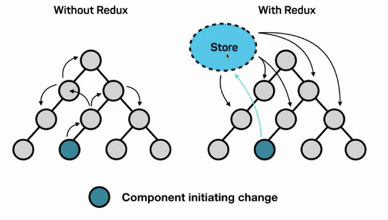
        - ### `Redux = Reducer + Flux`
            - 在 2013年 React 开源的时候，FaceBook 除了放出 React 之外，还放出了最原始的 **`Flux`** 这个辅助 React 使用的 数据层框架，后来才慢慢的被 优化升级成了 Redux
        - ### Flux架构：单向数据流
            - 

    - ## 5-2 Redux的工作流程
        - 
        - ### 打个比喻
            - 我们去图书馆借书 的流程
            - 角色：
                - React Components : 借书人
                - Action Creators : 借书的行为 (我要借 某某书)
                - Store : 图书馆管理员
                - Reducers : 图书索 笔记本  ==> 查阅 图书索引的行为 (查阅手册，找书的位置)
            - 借书流程：
                - 【React Components : 借书人】 说：我要借 某某书
                - 【Action Creators : 借书的行为】 被 【Store : 图书馆管理员】听到了
                - 【Store : 图书馆管理员】去查阅【Reducers】
                - 找到书的位置，把书拿给 【React Components : 借书人】

    - ## 5-4 创建redux中的store
        - ### store 与 reducer 的打通
            - 首先，在 `/src/store/index.js` 目录下 创建 store.js 文件
                ```js
                // /src/store/index.js

                import { createStore } from 'redux'

                const store = createStore()

                export default store
                ```
                - 现在 store 就创建好了
                - 但是 store 记不住该 怎么管理我的数据，他需要 一个笔记本 来查阅  自己该如何管理数据，也就是 它还需要一个 **`Reducers`**
            
            - 所以还需要 创建一个 笔记本，用于存放 该如何操作 各种各样数据的方法
                - `reducer.js` 只需要返回一个 函数 就可以了
                ```js
                // /src/store/reducer.js

                const defaultState = {}

                export default (state = defaultState, action) => {
                    return state
                }
                ```

            - 然后
                ```js
                // /src/store/index.js

                import { createStore } from 'redux'
                import reducer from './reducer'    // 引入笔记本

                const store = createStore(reducer) // 当 创建 store 的时候，把笔记本 传给 store

                export default store
                ```

            - 写到这里，我们再来看一下上面这张图
                - 
                - 1.我们创建了 reducer ，它里面负责存储一些 整个项目中的数据
                - 2.然后把 reducer 传给 store , 这样的话，创建的这个 store , 它仓库 里面有多少数据，都可以去 reducer 里面去查看了

            - 然后，再进一步：我们可以在 reducer 里写上 默认data
                ```js
                // /src/store/reducer.js

                const defaultState = {
                    inputValue: '123',
                    list: [1, 2]
                }

                export default (state = defaultState, action) => {
                    return state
                }
                ```
                - 这样的话，当 `createStore(reducer)` 创建 store 之后，store 就知道 仓库里有 多少数据了
        - ### 如何取数据？
            - 问题：
                - 到这里，目前 store 创建好了，而且 store 也有数据了
                - 那 Component 如果去取 store 里面的数据呢 ？
            - 如何取 store 里面的数据？
                ```jsx
                // Component
                import React, { Component } from 'react
                import store from '/src/store'

                class TodoList extends Component {
                    constructor (props) {
                        super(props)
                        this.state = store.getState() // 获取 store 里面的数据

                        console.log( store.getState() )  // 可以打印出 store 里面的数据
                    }

                    render () {
                        return (
                            <div>
                                <div>{ this.state.inputValue } 读取数据 </div>
                            </div>
                        )
                    }
                }
                ```
    - ## 5-5 Action和Reducer的编写
        - ### Redux DevTools
            - 谷歌浏览器 搜索安装 `Redux DevTools` 工具
            - 增加一行代码去激活这个工具
                ```diff
                // /src/store/index.js

                import { createStore } from 'redux'
                import reducer from './reducer'         // 引入笔记本

                const store = createStore(
                    reducer,                            // 当 创建 store 的时候，把笔记本 传给 store
                +   window.__REDUX_DEVTOOLS_EXTENSION__ && window.__REDUX_DEVTOOLS_EXTENSION__()
                )

                export default store
                ```
        - ### Action和Reducer的交互流程
            - #### Step 1.首先 创建Action
                - 创建Action 的时候，要复合一定的规范
                    - 它一定是一个对象
                > 创建Action <br>
                > 打个比喻：意思是：我要创建一句话，去告诉 store 管理员，我想要做什么
                ```js
                const action = {
                    type: 'inputChange',
                    value: e.target.value
                }
                ```
            - #### Step 2.有了这句话后，我要 把这句话 传给 store
                - 那么，我该如何把这句话 传给 store 呢？
                - 回到上面这张图：[5-2 Redux的工作流程图](#5-2-Redux的工作流程)
                - 我们发现，通过 `store.dispatch(action)` 方法，就可以把 `action` 传给 `store`
                ```js
                function handleInputChange (e) {
                    const action = {
                        type: 'inputChange',
                        value: e.target.value
                    }
                    store.dispatch(action)  // 把 `action` 传给 `store`
                }
                ```
            - #### Step 3.现在 store 接收到了 这个数据 (action)，但是 store 不知道该如何处理 这个 action
                - 所以，store 要去 查手册 (reducer)
                    - `(previousState, action)`
                    - 把当前的 `state` 和 接收到到这个 `action`, 一起转发给 `reducer`
                    - `reducer` 来告诉你 (store), 你要做什么
                    > redux 里面的 store 会自动的完成这个动作：<br>
                    > 当 store 接收到 action ，就会把 `(previousState, action)` 自动转发给 `reducer`
                - 真的是这样到吗？ 下面我们来 测试一下
                    ```js
                    // /src/store/reducer.js

                    const defaultState = {
                        inputValue: '123',
                        list: [1, 2]
                    }

                    export default (state = defaultState, action) => {
                        console.log(state, 'state', action, 'action')  // 这里 我们来打印一下，发现结果 确实是这样
                        return state
                    }
                    ```
                - 到这里，我们拿到了 之前的 `state` (previousState), 也拿到了 `action` (知道 你想要干什么了)
                    - 所以
                    ```js
                    // /src/store/reducer.js

                    const defaultState = {
                        inputValue: '123',
                        list: [1, 2]
                    }

                    export default (state = defaultState, action) => {
                        console.log(state, 'state', action, 'action')   // 这里 我们来打印一下，发现结果 确实是这样
                        if ( action.type === 'inputChange' ) {          // 如果你要 做某某事情，就...
                            const newState = JSON.parse(JSON.stringify(state))  // 对 previousState 做一次深拷贝
                            newState.inputValue = action.value     // 对目标参数赋值
                            return newState     // 返回新 state
                        }
                        if ( action.type === 'itemDelect' ) {
                            console.log(action, 'action');
                            const newState = JSON.parse(JSON.stringify(state))
                            newState.list.splice(action.index, 1)
                            return newState
                        }
                        if ( action.type === 'InputChangeEnter' ) {
                            const newState = JSON.parse(JSON.stringify(state))
                            newState.list.push(action.value)
                            return newState
                        }
                        return state
                    }
                    ```
                    > **`reducer` 的原则**: `reducer` 可以接收 `state`, 但是绝不能修改 `state`。只能返回 `newState`
            - #### Step 4.`reducer` 将 `newState` 返回给 `store` 后
                - **`store`** 会自动将 `newState` 替换掉 `store` 中的老数据 `state`
                    - 这里，我们也可以测试一下：
                        - 在 `redux devTools` 里打开, 改变 input 输入值，然后观察 `redux devTools` 里的 `State` 的变化
                - 到这里，你会发现一个问题：
                    - 你变化了 `State` 里面到数据，但是 页面上的数据 并没有 跟着更新，这是怎么回事呢？
                - 解决办法：
                    - 我们回到组件中，订阅 `store` 的变化
                ```jsx
                // Component
                import React, { Component } from 'react
                import store from '/src/store'
                import { List, Input } from 'antd'

                class TodoList extends Component {
                    constructor (props) {
                        super(props)
                        this.state = store.getState() // 获取 store 里面的数据
                        this.handleInputChange = this.handleInputChange.bind(this)

                        this.handleStoreChange = this.handleStoreChange.bind(this)
                        store.subscribe(this.handleStoreChange)  // 订阅 `store` 的变化
                    }

                    function handleStoreChange () {
                        this.setState(store.getState())
                    }

                    handleInputChange (e) {
                        const action = {
                            type: 'inputChange',
                            value: e.target.value
                        }
                        store.dispatch(action)
                    }

                    handleItemDelect (index) {
                        const action = {
                            type: 'itemDelect',
                            index
                        }
                        store.dispatch(action)
                    }

                    handleInputChangeEnter (e) {
                        const action = {
                            type: 'InputChangeEnter',
                            value: e.target.value
                        }
                        store.dispatch(action)
                    }


                    render () {
                        return (
                            <div>
                                <div>{ this.state.inputValue } 读取数据 </div>

                                <Input
                                style={{width: '300px'}}
                                value={this.state.inputValue}
                                onChange={ (e)=> this.handleInputChange(e) }
                                onPressEnter={ e => this.handleInputChangeEnter(e) }
                                ></Input>

                                <List
                                style={{width: '300px', margin: '10px auto', padding: '10px', border: '1px solid #eee'}}
                                dataSource={this.state.list}
                                renderItem={ (item, index) => (<List.Item onClick={ ()=> this.handleItemDelect(index) } >{ item }</List.Item>)}
                                ></List>

                            </div>
                        )
                    }
                }
                ```
            - #### Step 5.到这里整个 `Redux Flow` 工作流程 就走完了，数据也更新上来了

    - ## 5-7 ActionTypes的拆分
        > 在 JS引擎中，<br>
        > **`如果字符串写错了，是不会报错的，`**<br>
        > **`但是 如果JS变量写错了，就是一定会报错的`**<br>
        > 所以 这样是 有利于代码查错的
        - ### 可能存在的问题
            - 我们先看回上节课的代码中
                - 每一个 `function` 都在派发 `action`
                - 而且 每一个 `action` 里面 都有一个 `type`
                ```js
                handleInputChange (e) {
                    const action = {
                        type: 'inputChange',
                        value: e.target.value
                    }
                    store.dispatch(action)
                }

                handleItemDelect (index) {
                    const action = {
                        type: 'itemDelect',
                        index
                    }
                    store.dispatch(action)
                }

                handleInputChangeEnter (e) {
                    const action = {
                        type: 'InputChangeEnter',
                        value: e.target.value
                    }
                    store.dispatch(action)
                }
                ```
            - 假如 这个时候 我们把 `type: 'inputChange'` 错写成了 `type: 'inpvtChange'`
                - 那么，这个代码在调试的时候发现，
                - 它怎么都不执行，也不报错
                - 有时候你可能 找了很久 就不知道错误在哪里。`这样非常不利于代码的查错`
        - ### 解决方案
            - 在 `actionTypes.js` 中定义 几个常量
                ```js
                // /src/store/actionTypes.js

                export const INPUT_CHANGE = 'inputChange'
                export const ITEM_DELETE = 'itemDelect'
                export const INPUT_CHANGE_ENTER = 'InputChangeEnter'
                ```
            - 然后在 `component` 中引入 并 使用该 常量
                ```jsx
                // Component
                import React, { Component } from 'react
                import store from '/src/store'
                import { INPUT_CHANGE, ITEM_DELETE, INPUT_CHANGE_ENTER } from '/src/store/actionTypes'  // 引入常量
                import { List, Input } from 'antd'

                class TodoList extends Component {
                    constructor (props) {
                        super(props)
                        this.state = store.getState()
                        this.handleInputChange = this.handleInputChange.bind(this)

                        this.handleStoreChange = this.handleStoreChange.bind(this)
                        store.subscribe(this.handleStoreChange)
                    }

                    function handleStoreChange () {
                        this.setState(store.getState())
                    }

                    handleInputChange (e) {
                        const action = {
                            type: INPUT_CHANGE,  // 使用该常量
                            value: e.target.value
                        }
                        store.dispatch(action)
                    }

                    handleItemDelect (index) {
                        const action = {
                            type: ITEM_DELETE,  // 使用该常量
                            index
                        }
                        store.dispatch(action)
                    }

                    handleInputChangeEnter (e) {
                        const action = {
                            type: INPUT_CHANGE_ENTER,  // 使用该常量
                            value: e.target.value
                        }
                        store.dispatch(action)
                    }


                    render () {
                        return (
                            <div>
                                <div>{ this.state.inputValue } 读取数据 </div>

                                <Input
                                style={{width: '300px'}}
                                value={this.state.inputValue}
                                onChange={ (e)=> this.handleInputChange(e) }
                                onPressEnter={ e => this.handleInputChangeEnter(e) }
                                ></Input>

                                <List
                                style={{width: '300px', margin: '10px auto', padding: '10px', border: '1px solid #eee'}}
                                dataSource={this.state.list}
                                renderItem={ (item, index) => (<List.Item onClick={ ()=> this.handleItemDelect(index) } >{ item }</List.Item>)}
                                ></List>

                            </div>
                        )
                    }
                }
                ```
            - 然后在 `reducer` 中也要引入 并 使用该 常量
                ```js
                // /src/store/reducer.js

                import { INPUT_CHANGE, ITEM_DELETE, INPUT_CHANGE_ENTER } from '/src/store/actionTypes'  // 引入常量
                const defaultState = {
                    inputValue: '123',
                    list: [1, 2]
                }

                export default (state = defaultState, action) => {
                    console.log(state, 'state', action, 'action')   // 这里 我们来打印一下，发现结果 确实是这样
                    if ( action.type === INPUT_CHANGE ) {          // 如果你要 做某某事情，就...
                        const newState = JSON.parse(JSON.stringify(state))  // 对 previousState 做一次深拷贝
                        newState.inputValue = action.value     // 对目标参数赋值
                        return newState     // 返回新 state
                    }
                    if ( action.type === ITEM_DELETE ) {        // 使用该常量
                        const newState = JSON.parse(JSON.stringify(state))
                        newState.list.splice(action.index, 1)
                        return newState
                    }
                    if ( action.type === INPUT_CHANGE_ENTER ) {  // 使用该常量
                        const newState = JSON.parse(JSON.stringify(state))
                        newState.list.push(action.value)
                        return newState
                    }
                    return state
                }
                ```
            - #### 总结：
                - 虽然这样写起来，又多了一个文件，代码理解起来 又复杂了一步
                - 但是，这样写，带来一个好处：
                    - 当你在写代码的时候，如果把 `INPUT_CHANGE` 错写成了 `INPVT_CHANGE`
                    - 那么它就会自己报错 `INPVT_CHANGE is not defined`
                    - 这样就非常有利于 代码查错


    - ## 5-8 使用actionCreator统一创建action
        - ### 存在的问题：在之前的写法中，我们都是将 `action` 分别写在各个函数中的
            - 这样的话，会导致 action 不好统一管理
            - 接下来，我们用一个 统一的 `actionCreator` 文件来统一存放 我们的 `action`, 提高代码的 **`可维护性`**
            ```jsx
            // component
            handleInputChange (e) {
                const action = {
                    type: INPUT_CHANGE,  // 使用该常量
                    value: e.target.value
                }
                store.dispatch(action)
            }

            handleItemDelect (index) {
                const action = {
                    type: ITEM_DELETE,  // 使用该常量
                    index
                }
                store.dispatch(action)
            }

            handleInputChangeEnter (e) {
                const action = {
                    type: INPUT_CHANGE_ENTER,  // 使用该常量
                    value: e.target.value
                }
                store.dispatch(action)
            }
            ```
        - 看代码
            - `actionCreators.js` 里面的每一个 function 返回一个 `action`
                ```js
                // /src/store/actionCreators.js

                import { INPUT_CHANGE, ITEM_DELETE, INPUT_CHANGE_ENTER } from './actionTypes'

                export const getInputChangeAction = (value) => ({
                    type: INPUT_CHANGE,
                    value
                })
                export const getDeleteItemAction = (index) => ({
                    type: ITEM_DELETE,
                    index
                })
                export const getInputChangeEnterAction = (value) => ({
                    type: INPUT_CHANGE_ENTER,
                    value
                })
                ```
            - 引入 并使用 `actionCreators`
                ```js
                // Component
                import React, { Component } from 'react
                import store from '/src/store'
                import { getInputChangeAction, getDeleteItemAction, getInputChangeEnterAction } from '/src/store/actionCreators'  // 引入 actionCreator
                import { List, Input } from 'antd'

                class TodoList extends Component {
                    constructor (props) {
                        super(props)
                        this.state = store.getState()
                        this.handleInputChange = this.handleInputChange.bind(this)

                        this.handleStoreChange = this.handleStoreChange.bind(this)
                        store.subscribe(this.handleStoreChange)
                    }

                    function handleStoreChange () {
                        this.setState(store.getState())
                    }

                    handleInputChange (e) {
                        const action = getInputChangeAction(e.target.value)  // 使用 actionCreator
                        store.dispatch(action)
                    }

                    handleItemDelect (index) {
                        const action = getDeleteItemAction(index)  // 使用 actionCreator
                        store.dispatch(action)
                    }

                    handleInputChangeEnter (e) {
                        const action = getInputChangeEnterAction(e.target.value)  // 使用 actionCreator
                        store.dispatch(action)
                    }


                    render () {
                        return (
                            <div>
                                <div>{ this.state.inputValue } 读取数据 </div>

                                <Input
                                style={{width: '300px'}}
                                value={this.state.inputValue}
                                onChange={ (e)=> this.handleInputChange(e) }
                                onPressEnter={ e => this.handleInputChangeEnter(e) }
                                ></Input>

                                <List
                                style={{width: '300px', margin: '10px auto', padding: '10px', border: '1px solid #eee'}}
                                dataSource={this.state.list}
                                renderItem={ (item, index) => (<List.Item onClick={ ()=> this.handleItemDelect(index) } >{ item }</List.Item>)}
                                ></List>

                            </div>
                        )
                    }
                }
                ```

    - ## 5-9 Redux知识点复习补充
        - ### **`Redux 主要API`**
            |Redux 主要API|解释|
            |----|----|
            |`createStore()`|创建 store|
            |`store.dispatch(action)`|帮助我们派发 action, 这个 action 会传递给 store|
            |`store.getState()`|可以获取到 store 中所有的内容|
            |`store.subscribe(callback)`|可以订阅 store 的改变，只要 store 发生改变，callback 就会被执行|

        - ### **`Redux 设计和使用的三项原则`**
            - 1.**`Store 必须是唯一的`**
                - 在整个项目中，只能有一个 `Store`
                - 它在哪呢？ 在 `/src/store/index.js` 中 通过 `createStore()` 创建的
                - 创建后 导出出去，外部的所有组件 都是使用的 同一个 `Store`
            - 2.**`只有 Store 能够改变自己的内容`**
                - 谁在改变 `Store` 中的内容？
                    ```js
                    // /src/store/reducer.js

                    const defaultState = { inputValue: '123', list: [1, 2] }

                    export default (state = defaultState, action) => {
                        if ( action.type === 'inputChange' ) {
                            const newState = JSON.parse(JSON.stringify(state))
                            newState.inputValue = action.value
                            return newState
                        }
                        return state
                    }
                    ```
                - 看到 `reducer` 的代码, 很多人认为 是 `reducer` 在改变 `Store` 的内容
                - 实际上，不是这样的
                    - `reducer` 只做了一个工作：拿到 `preState`, 深拷贝一份 `state` 得到 `newState`, 然后改变 `newState` 的数据, 最后返回一个 `newState` 给 `Store`
                    - `Store` 拿到 `newState` 后，自己对自己更新的。而不是 `reducer` 在改变 `Store` 的内容
            - 3.**`Reducer 必须是纯函数`**
                > `纯函数` 的定义: 给定固定的输入，就一定会有固定的输出，而且不会有任何副作用
                - 在 `reducer` 中，只要入参一样，即 `preState` 和 `action`，那么就一定会返回固定的 `newState`
                - (1) 那么，什么是 不纯的函数呢？下面我们来举个例子
                    ```js
                    const defaultState = { inputValue: '123', list: [1, 2] }

                    export default (state = defaultState, action) => {
                        if ( action.type === 'inputChange' ) {
                            const newState = JSON.parse(JSON.stringify(state))
                            newState.inputValue = new Date()  // 这就不是一个 纯函数，因为返回的结果 不止受到 入参的影响
                            return newState
                        }
                        return state
                    }
                    ```
                    - 在上面这个函数中，给定固定的输入，在任何时候 都会返回固定的输出，这一点 它就不满足了，所以它不是一个纯函数
                        - 只要函数中有 `setTimeout, Ajax, 或者和日期相关的内容`，那么他就不再是一个 纯函数了
                    - 所以 `reducer` 中，不能有 **异步操作，跟时间相关的操作**
                - (2) 那么，什么是 副作用呢？
                    ```js
                    const defaultState = { inputValue: '123', list: [1, 2] }

                    export default (state = defaultState, action) => {
                        if ( action.type === 'inputChange' ) {
                            const newState = JSON.parse(JSON.stringify(state))
                            newState.inputValue = action.value
                            state.inputValue = action.value    // 对函数 外面环境的 进行修改，就产生了副作用
                            return newState
                        }
                        return state
                    }
                    ```
                    - 如果 函数产生了 副作用，那么 他也就不是一个 纯函数了


- # 第6章 Redux进阶
    - ## 6-1 UI组件和容器组件
        > 在业界中，我们<br>
        > 把 **`UI组件`** 叫做 `傻瓜组件`<br>
        > 把 **`容器组件`** 叫做 `聪明组件`<br>
        > <br>
        > **`UI组件`**：为什么说他傻呢？ 因为它的页面中没有任何的逻辑，只负责显示。所以 我们说它比较的傻<br>
        > **`容器组件`**：为什么说他聪明呢？ 因为 容器组件 的页面中 它不去管你页面怎么显示、不去管你的UI，只关注业务逻辑，负责功能实现。所以 我们说它比较的聪明<br>
        - 那么接下来，我们来看一下 `UI组件` 和 `容器组件` 分别是什么
            - 在前面的代码中, 我们通常将 `页面UI` 和 `页面逻辑` 写在一个组件中。
                - `render(){ return (...) }` 负责 UI视图
                - 其它部分，如 function、变量 等 负责页面逻辑
            - 这样的话，如果内容多了，组件就会变得难以维护了
        - 所以，下面我来进行拆分，将 `页面UI` 和 `页面逻辑` 分别拆开
            - `UI组件` 负责渲染
            - `容器组件` 负责逻辑
    - 看代码：原来 我们组件的写法，是把所有东西都写在一个文件中。但是，如果内容多了，组件就会变得难以维护了
        ```js
        // Component
        import React, { Component } from 'react
        import store from '/src/store'
        import { getInputChangeAction, getDeleteItemAction, getInputChangeEnterAction } from '/src/store/actionCreators'  // 引入 actionCreator
        import { List, Input } from 'antd'

        class TodoList extends Component {
            constructor (props) {
                super(props)
                this.state = store.getState()
                this.handleInputChange = this.handleInputChange.bind(this)

                this.handleStoreChange = this.handleStoreChange.bind(this)
                store.subscribe(this.handleStoreChange)
            }

            function handleStoreChange () {
                this.setState(store.getState())
            }

            handleInputChange (e) {
                const action = getInputChangeAction(e.target.value)  // 使用 actionCreator
                store.dispatch(action)
            }

            handleItemDelect (index) {
                const action = getDeleteItemAction(index)  // 使用 actionCreator
                store.dispatch(action)
            }

            handleInputChangeEnter (e) {
                const action = getInputChangeEnterAction(e.target.value)  // 使用 actionCreator
                store.dispatch(action)
            }


            render () {
                return (
                    <div>
                        <div>{ this.state.inputValue } 读取数据 </div>
                        <Input
                            style={{width: '300px'}}
                            value={this.state.inputValue}
                            onChange={ (e)=> this.handleInputChange(e) }
                            onPressEnter={ e => this.handleInputChangeEnter(e) }
                        ></Input>
                        <List
                            style={{width: '300px', margin: '10px auto', padding: '10px', border: '1px solid #eee'}}
                            dataSource={this.state.list}
                            renderItem={ (item, index) => (<List.Item onClick={ ()=> this.handleItemDelect(index) } >{ item }</List.Item>)}
                        ></List>
                    </div>
                )
            }
        }
        ```
    - 下面，我们来 把组件文件 进行拆分
        - ### 1.拆分 **`UI组件`**
            - 也就是 把 HTML 部分 拆出来，单独写成一个文件
            ```js
            // /src/TodoListUI.js

            import React, {Component} from 'react'
            import { List, Input } from 'antd'

            class TodoListUI extends Component {
                render () {
                    return (
                        <div>
                            <div>{ this.props.inputValue } 读取数据 </div>
                            <Input
                                style={{width: '300px'}}
                                value={this.state.inputValue}
                                onChange={ e=> this.props.handleInputChange(e) }
                                onPressEnter={ e => this.props.handleInputChangeEnter(e) }
                            ></Input>
                            <List
                                style={{width: '300px', margin: '10px auto', padding: '10px', border: '1px solid #eee'}}
                                dataSource={this.props.list}
                                renderItem={ (item, index) => (<List.Item onClick={ ()=> this.props.handleItemDelect(index) } >{ item }</List.Item>)}
                            ></List>
                        </div>
                    )
                }
            }
            ```

        - ### 2.拆分 **`容器组件`**
            ```js
            // Component
            import React, { Component } from 'react
            import store from '/src/store'
            import { getInputChangeAction, getDeleteItemAction, getInputChangeEnterAction } from '/src/store/actionCreators'  // 引入 actionCreator
            import TodoListUI from './TodoListUI'  // 引入UI组件

            class TodoList extends Component {
                constructor (props) {
                    super(props)
                    this.state = store.getState()
                    this.handleInputChange = this.handleInputChange.bind(this)

                    this.handleStoreChange = this.handleStoreChange.bind(this)
                    store.subscribe(this.handleStoreChange)
                }

                function handleStoreChange () {
                    this.setState(store.getState())
                }

                handleInputChange (e) {
                    const action = getInputChangeAction(e.target.value)  // 使用 actionCreator
                    store.dispatch(action)
                }

                handleItemDelect (index) {
                    const action = getDeleteItemAction(index)  // 使用 actionCreator
                    store.dispatch(action)
                }

                handleInputChangeEnter (e) {
                    const action = getInputChangeEnterAction(e.target.value)  // 使用 actionCreator
                    store.dispatch(action)
                }


                render () {
                    return <TodoListUI
                                inputValue={this.state.inputValue}
                                list={this.state.list}
                                handleInputChange={this.handleInputChange}
                                handleInputChangeEnter={this.handleInputChangeEnter}
                                handleItemDelect={this.handleItemDelect}
                            />     {/* 使用 渲染该UI组件 */}
                }
            }
            ```

    - ## 6-2 无状态组件
        > 无状态组件 的优点:<br>
        > 由于 `无状态组件` 是一个函数组件，所以它不像 `class组件`,<br>
        > `class组件` 除了要执行 `render()` 函数，还要执行 生命周期函数 等一系列其它函数<br>
        > 正是由于这种原因，所以 `无状态组件 性能比较高`<br>
        > <br>
        > 所以，以后如果看到一个组件 只有 `render()` 函数, 那就可以把它改写成 无状态组件，从而提高性能<br>
        > <br>
        > <br>
        > 另外，虽然理论上 UI组件 应该只负责渲染，但是有的时候 你让它做一些简单的 逻辑计算 也是可以的，具体情况根据实际需求来<br>
        - 前言
            - 在此之前，我们接触过的组件 可真不少，有 普通组件、UI组件、容器组件
            - 我们今天再来 认识一下 无状态组件
        - ### 无状态组件 是什么？
            - 我们先来看一下 之前的 `UI组件`
                - 这个 UI组件 比较奇特，它里面只有一个 `render()` 函数
                - 当一个组件里面只有一个 `render()` 函数的时候，我们就可以用 `无状态组件` 来定义这个组件
                    ```js
                    // UI组件

                    import React, {Component} from 'react'
                    import { List, Input } from 'antd'

                    class TodoListUI extends Component {
                        render () {
                            return (
                                <div>
                                    <div>{ this.props.inputValue } 读取数据 </div>
                                    <Input
                                        style={{width: '300px'}}
                                        value={this.state.inputValue}
                                        onChange={ e=> this.props.handleInputChange(e) }
                                        onPressEnter={ e => this.props.handleInputChangeEnter(e) }
                                    ></Input>
                                    <List
                                        style={{width: '300px', margin: '10px auto', padding: '10px', border: '1px solid #eee'}}
                                        dataSource={this.props.list}
                                        renderItem={ (item, index) => (<List.Item onClick={ ()=> this.props.handleItemDelect(index) } >{ item }</List.Item>)}
                                    ></List>
                                </div>
                            )
                        }
                    }
                    ```
            - 那么 如何定义一个 `无状态组件` 呢？
                - **`无状态组件 其实就是一个函数组件`**
                ```jsx
                // 无状态组件
                import React, {Component} from 'react'
                import { List, Input } from 'antd'

                const TodoListUI = (props) => {
                    return (
                        <div>
                            <div>{ props.inputValue } 读取数据 </div>
                            <Input
                                style={{width: '300px'}}
                                value={state.inputValue}
                                onChange={ e => props.handleInputChange(e) }
                                onPressEnter={ e => props.handleInputChangeEnter(e) }
                            ></Input>
                            <List
                                style={{width: '300px', margin: '10px auto', padding: '10px', border: '1px solid #eee'}}
                                dataSource={props.list}
                                renderItem={ (item, index) => (<List.Item onClick={ ()=> props.handleItemDelect(index) } >{ item }</List.Item>)}
                            ></List>
                        </div>
                    )
                }
                ```
    - ## 6-3 Redux 中发送异步请求获取数据
        - ### Charles 的使用
            > 本地测试中，如果后端数据接口没开发好，我们可以使用 Charles 这个软件，做电脑本地的请求转发 <br>
            > 比如说：我们在代码中请求的 接口地址是 './list.json', 然后在 Charles 中配置，将拦截链接请求，转发到到本地到某个文件下，如 './list.json' 这样到话 <br>
            > 这样的话，当我们请求接口，Charles 就会帮我们拿到本地的 './list.json' 文件数据返回 给到我们前端。就能实现 没有真实的后端接口 也能调试本地前端代码的效果
            - 具体实现步骤
                - 1.菜单-工具-Map Local, 添加新的转发规则
                    ```
                    Map Form
                        - Protocol: http
                        - Host: localhost
                        - Prot: 3000
                        - Path: /list.json

                    Map To
                        - Local Path: (选择一个本地的文件，如 './list.json')
                    ```
                - 2.创建文件
                    ```js
                    // ./list.json

                    ['hello', 'dell', 'lee']
                    ```
                - 3.这样配置完后，就能实现 按照规则 拦截转发了
        - 回到我们之前的组件中
            ```js
            // Component
            import React, { Component } from 'react
            import store from '/src/store'
            import { getInputChangeAction, getDeleteItemAction, getInputChangeEnterAction, getInitListAction } from '/src/store/actionCreators' // 引入 getInitListAction
            import TodoListUI from './TodoListUI'  // 引入UI组件
            import axios from 'axios'

            class TodoList extends Component {
                constructor (props) {
                    super(props)
                    this.state = store.getState()
                    this.handleInputChange = this.handleInputChange.bind(this)

                    this.handleStoreChange = this.handleStoreChange.bind(this)
                    store.subscribe(this.handleStoreChange)
                }

                componentDidMount () {
                    axios.get('./list.json').then(res => {  // 发送请求
                        const data = res.data
                        const action = getInitListAction(data) // 创建action
                        store.dispatch(action)  // action 传递给 store
                    })
                }

                function handleStoreChange () {
                    this.setState(store.getState())
                }

                handleInputChange (e) {
                    const action = getInputChangeAction(e.target.value)
                    store.dispatch(action)
                }

                handleItemDelect (index) {
                    const action = getDeleteItemAction(index)
                    store.dispatch(action)
                }

                handleInputChangeEnter (e) {
                    const action = getInputChangeEnterAction(e.target.value)
                    store.dispatch(action)
                }


                render () {
                    return <TodoListUI
                                inputValue={this.state.inputValue}
                                list={this.state.list}
                                handleInputChange={this.handleInputChange}
                                handleInputChangeEnter={this.handleInputChangeEnter}
                                handleItemDelect={this.handleItemDelect}
                            />     {/* 使用 渲染该UI组件 */}
                }
            }
            ```
        - `actionCreators.js` 里 创建一个 `action`
            ```js
            // /src/store/actionCreators.js

            import { INPUT_CHANGE, ITEM_DELETE, INPUT_CHANGE_ENTER, INIT_LIST_ACTION } from './actionTypes'

            export const getInputChangeAction = (value) => ({
                type: INPUT_CHANGE,
                value
            })
            export const getDeleteItemAction = (index) => ({
                type: ITEM_DELETE,
                index
            })
            export const getInputChangeEnterAction = (value) => ({
                type: INPUT_CHANGE_ENTER,
                value
            })
            export const getInitListAction = (value) => ({  // 创建 action
                type: INIT_LIST_ACTION,
                value
            })
            ```
            ```js
            // /src/store/actionTypes.js

            export const INPUT_CHANGE = 'inputChange'
            export const ITEM_DELETE = 'itemDelect'
            export const INPUT_CHANGE_ENTER = 'InputChangeEnter'
            export const INIT_LIST_ACTION = 'initListAction'  // 新增常量
            ```

        - reducer
            ```js
            // /src/store/reducer.js

            import { INPUT_CHANGE, ITEM_DELETE, INPUT_CHANGE_ENTER, INIT_LIST_ACTION } from '/src/store/actionTypes'  // 引入常量
            const defaultState = {
                inputValue: '123',
                list: [1, 2]
            }

            export default (state = defaultState, action) => {
                if ( action.type === INIT_LIST_ACTION ) {  // 新增处理 reducer
                    const newState = JSON.parse(JSON.stringify(state))
                    newState.list = action.value
                    return newState
                }
                if ( action.type === INPUT_CHANGE ) {
                    const newState = JSON.parse(JSON.stringify(state))
                    newState.inputValue = action.value
                    return newState
                }
                if ( action.type === ITEM_DELETE ) {
                    const newState = JSON.parse(JSON.stringify(state))
                    newState.list.splice(action.index, 1)
                    return newState
                }
                if ( action.type === INPUT_CHANGE_ENTER ) {
                    const newState = JSON.parse(JSON.stringify(state))
                    newState.list.push(action.value)
                    return newState
                }
                return state
            }
            ```
        - **总结：到这里 就完成了 Redux 中发送异步请求获取数据 的实现**


    - ## 6-4 使用Redux-thunk中间件实现ajax数据请求
        - 存在的问题
            - 看如下代码
            - 如果我们把 这些异步请求、或者过于复杂的逻辑，都放在一个组件中
            - 那么，当代码量大了以后，这个组件就会变得 难以维护、过于复杂
            - 所以，我们这一节，就要介绍 如何 `使用Redux-thunk中间件实现ajax数据请求`，将所有 异步请求api 放在一个单独都文件里 来统一管理
            ```js
            // Component
            import React, { Component } from 'react
            import store from '/src/store'
            import { getInputChangeAction, getDeleteItemAction, getInputChangeEnterAction, getInitListAction } from '/src/store/actionCreators' // 引入 getInitListAction
            import TodoListUI from './TodoListUI'  // 引入UI组件
            import axios from 'axios'

            class TodoList extends Component {
                constructor (props) {
                    super(props)
                    this.state = store.getState()
                    this.handleInputChange = this.handleInputChange.bind(this)

                    this.handleStoreChange = this.handleStoreChange.bind(this)
                    store.subscribe(this.handleStoreChange)
                }

                componentDidMount () {
                    axios.get('./list.json').then(res => {  // 在组件中发起请求异步请求
                        const data = res.data
                        const action = getInitListAction(data)
                        store.dispatch(action)
                    })
                }

                // ...
            }
            ```
        - ### Redux-thunk可以干嘛？
            - Redux-thunk中间件允许我们，把异步请求、或复杂的逻辑 放到action里 去处理
            - [redux-thunk 官方github文档](https://github.com/reduxjs/redux-thunk)
        - ### Redex-thunk如何使用？
            - `npm install redux-thunk` 安装
            - #### store 配置 Redex-thunk
                - 引入 `applyMiddleware` 方法，它使得我们可以 使用中间件
                ```js
                // /src/store/index.js

                import { createStore, applyMiddleware } from 'redux'
                import thunk from 'redux-thunk'         // 引入 redux-thunk
                import reducer from './reducer'         // 引入笔记本

                const store = createStore(
                    reducer,                            // 当 创建 store 的时候，把笔记本 传给 store
                    applyMiddleware(thunk),             // 创建 store 时，使用中间件 thunk
                )

                export default store
                ```
                - 但是，这样写 又引出了新问题：
                    - 没法使用 `window.__REDUX_DEVTOOLS_EXTENSION__ && window.__REDUX_DEVTOOLS_EXTENSION__()` 了
                    - **`两个中间件没法一起使用了`**
                    - 那么 这个问题该如何解决呢？
                - 我们去到 github 找文档，[redux-devtools-extension](https://github.com/zalmoxisus/redux-devtools-extension)
                    - 找到高级设置 [1.2 Advanced store setup](https://github.com/zalmoxisus/redux-devtools-extension#12-advanced-store-setup)
                    ```js
                    const composeEnhancers =
                        typeof window === 'object' &&
                        window.__REDUX_DEVTOOLS_EXTENSION_COMPOSE__ ?   
                            window.__REDUX_DEVTOOLS_EXTENSION_COMPOSE__({
                            // Specify extension’s options like name, actionsBlacklist, actionsCreators, serialize...
                            }) : compose;
                    ```
                - 所以，我们在代码中 将上面代码改写成
                    ```js
                    // /src/store/index.js

                    import { createStore, applyMiddleware, compose } from 'redux'
                    import thunk from 'redux-thunk'         // 引入 redux-thunk
                    import reducer from './reducer'         // 引入笔记本


                    const composeEnhancers =
                        window.__REDUX_DEVTOOLS_EXTENSION_COMPOSE__ ?   
                            window.__REDUX_DEVTOOLS_EXTENSION_COMPOSE__({}) : compose;

                    const enhancer = composeEnhancers(
                        applyMiddleware(thunk),
                        // other store enhancers if any
                    );

                    const store = createStore(reducer, enhancer)  // 这样 创建store的时候，就不需要传 applyMiddleware(thunk) 了

                    export default store
                    ```
            - 配置好后，我们就能使用 thunk 的功能了
                - 如，我们把之前 放在 `ComponentDidMount` 的异步请求，放在 action 中去
                ```js
                // Component

                // ...

                componentDidMount () {
                    axios.get('./list.json').then(res => {  // 在组件中发起请求异步请求
                        const data = res.data
                        const action = getInitListAction(data)
                        store.dispatch(action)
                    })
                }

                // ...
                ```
            - 看回到 action 的代码
                - 在原生的 redux 代码中，我们在 actionCreators.js 中，应该返回的是一个对象
                - 但是，我们使用了 thunk 之后，我们就能返回 一个函数了
                - 在这个函数中，我们 可以完成异步的操作
                > 使用 thunk 之后，action 不仅仅可以是一个对象了，它还可以是一个函数
                ```js
                // /src/store/actionCreators.js

                import axios from 'axios'
                import { INPUT_CHANGE, ITEM_DELETE, INPUT_CHANGE_ENTER, INIT_LIST_ACTION } from './actionTypes'

                export const getInputChangeAction = (value) => ({
                    type: INPUT_CHANGE,
                    value
                })
                export const getDeleteItemAction = (index) => ({
                    type: ITEM_DELETE,
                    index
                })
                export const getInputChangeEnterAction = (value) => ({
                    type: INPUT_CHANGE_ENTER,
                    value
                })
                export const getInitListAction = (value) => ({
                    type: INIT_LIST_ACTION,
                    value
                })
                export const getTodoList = () => {
                    return (dispatch) => {              // 当生成当 action 是一个函数的时候，这个函数是可以接收到 dispatch 方法的 (直接在参数里写 dispatch 就行)
                        axios.get('./list.json').then(res => {  // 使用 thunk后，在 actionCreators 返回的函数中，发起请求异步请求
                            const data = res.data
                            console.log(data)
                            const action = getInitListAction(data)
                            dispatch(action)            // 用 dispatch 把 action 传给 store
                        })
                    }
                }
                ```
                ```js
                // Component
                import React, { Component } from 'react
                import store from '/src/store'
                import { getTodoList, getInputChangeAction, getDeleteItemAction, getInputChangeEnterAction, getInitListAction } from '/src/store/actionCreators' // 引入 getInitListAction
                import TodoListUI from './TodoListUI'  // 引入UI组件
                import axios from 'axios'

                class TodoList extends Component {
                    constructor (props) {
                        super(props)
                        this.state = store.getState()
                        this.handleInputChange = this.handleInputChange.bind(this)

                        this.handleStoreChange = this.handleStoreChange.bind(this)
                        store.subscribe(this.handleStoreChange)
                    }

                    componentDidMount () {
                        const action = getTodoList()  // 此时 action 是一个未执行的函数
                        store.dispath(action)         // 把这个 未执行的函数 action 传给 store, store 就会自动执行 该函数
                    }

                    function handleStoreChange () {
                        this.setState(store.getState())
                    }

                    handleInputChange (e) {
                        const action = getInputChangeAction(e.target.value)
                        store.dispatch(action)
                    }

                    handleItemDelect (index) {
                        const action = getDeleteItemAction(index)
                        store.dispatch(action)
                    }

                    handleInputChangeEnter (e) {
                        const action = getInputChangeEnterAction(e.target.value)
                        store.dispatch(action)
                    }


                    render () {
                        return <TodoListUI
                                    inputValue={this.state.inputValue}
                                    list={this.state.list}
                                    handleInputChange={this.handleInputChange}
                                    handleInputChangeEnter={this.handleInputChangeEnter}
                                    handleItemDelect={this.handleItemDelect}
                                />     {/* 使用 渲染该UI组件 */}
                    }
                }
                ```

    - ## 6-5 什么是Redux中间件
        - 我们先看来看 关键字 "中间件"
            - 那么，到底是 谁和谁的中间呢？
            - 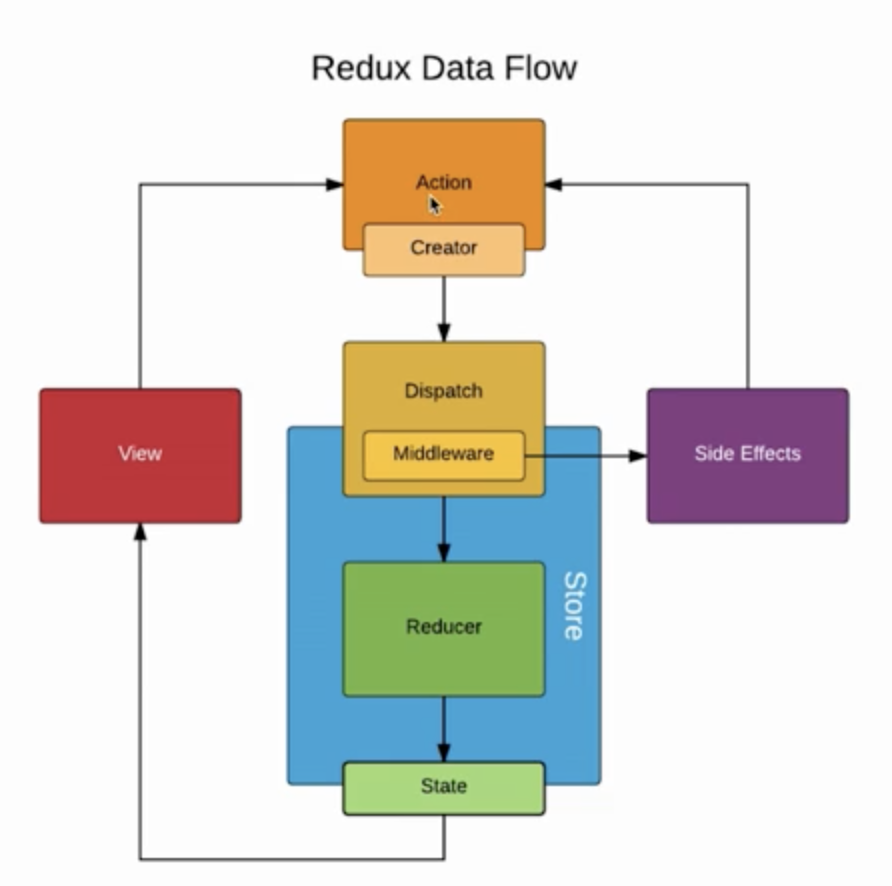
            - 实际上，这个中间件指的 就是 `action` 和 `store` 的中间
            - 我们使用 `thunk` 之后，实际上 就是对 `dispatch` 做了一个升级
                - 以前只能传对象，现在也可以传函数了
                - 当 `dispatch` 接收到的 是一个函数的时候，它会先把接收到的函数 先执行了，然后再传给 store

    - ## 6-6 Redux-saga中间件使用入门
        - 安装 `npm i redux-saga`
        - 使用
            - store 配置 saga
                - 参考 [saga文档](https://github.com/redux-saga/redux-saga#mainjs)
                ```js
                // /src/store/index.js

                import { createStore, applyMiddleware } from 'redux'
                import createSagaMiddleware from 'redux-saga'

                import reducer from './reducer'
                import saga from './sagas'       // 引入 saga 文件

                const sagaMiddleware = createSagaMiddleware()   // 创建中间件
                const composeEnhancers =
                    window.__REDUX_DEVTOOLS_EXTENSION_COMPOSE__ ?   
                        window.__REDUX_DEVTOOLS_EXTENSION_COMPOSE__({}) : compose;

                const enhancer = composeEnhancers( applyMiddleware(sagaMiddleware) )  // 使用中间件

                const store = createStore(reducer, enhancer)  // 这样 创建store的时候，就不需要传 applyMiddleware(thunk) 了

                sagaMiddleware.run(saga)    // 运行 引入的 saga 文件

                export default store
                ```
            - 使用 `sagas.js`
                - [sagas.js 配置文档](https://github.com/redux-saga/redux-saga#sagasjs)
                > 当我们配置使用里 redux-saga 之后，我们通过 `store.dispatch(action)` 派发的 action <br>
                > 除了 reducer 会接收到 action 之外，`/src/store/sagas.js` 的这个文件之中，也能够接收到 action
                - saga.js 里面的函数 必须要是 generator函数
                ```js
                // /src/store/sagas.js

                import { put, takeEvery } from 'redux-saga/effects'
                import { GET_INIT_LIST } from './actionTypes'
                import { getInitListAction } from './actionCreators'

                function * getInitList () {
                    // 把异步请求，放在 saga 中
                    const res = yield axios.get('./list.json')
                    const action = getInitListAction(res.data)
                    yield put(action)   // 等价于 store.dispatch(action)。 把获取到到数据结果 再创建一个action，给到 store, store 最终给到 reducer

                    // axios.get('./list.json).then( res => {      // 在generator函数中 不能写 promise 函数
                    //     const data = res.data
                    //     const action = getInitListAction(data)
                    //     // store.dispatch(action)          // saga 文件里，是没有 store 的，所以没法调用 store.dispatch 方法
                    //     put(action)  // 取而代之 我们应该用 put 方法
                    // })
                }

                // generator函数
                function * mySaga () {
                    yield takeEvery( GET_INIT_LIST, getInitList )   // takeEvery 我去捕捉每一个。 意思是 我监听 GET_INIT_LIST 这个 action, 只要我接收到了这个 action 我就执行 getInitList方法
                }

                export default mySaga
                ```
                - saga中错误处理
                    - 使用 `try catch` 来捕获异步请求错误
                    ```js
                    // /src/store/sagas.js

                    import { put, takeEvery } from 'redux-saga/effects'
                    import { GET_INIT_LIST } from './actionTypes'
                    import { getInitListAction } from './actionCreators'

                    function * getInitList () {
                        try {
                            const res = yield axios.get('./list.json')      // 有可能请求不到
                            const action = getInitListAction(res.data)
                            yield put(action)
                        } catch (e){
                            console.error('list.json 网络请求失败')
                        }
                    }

                    function * mySaga () {
                        yield takeEvery( GET_INIT_LIST, getInitList )
                    }

                    export default mySaga
                    ```
                - 在 action 里触发
                ```js
                // Component
                import React, { Component } from 'react
                import store from '/src/store'
                import { getInputChangeAction, getDeleteItemAction, getInputChangeEnterAction, getInitListAction, getInitList } from '/src/store/actionCreators' // 引入 getInitListAction
                import TodoListUI from './TodoListUI'  // 引入UI组件
                import axios from 'axios'

                class TodoList extends Component {
                    constructor (props) {
                        super(props)
                        this.state = store.getState()
                        this.handleInputChange = this.handleInputChange.bind(this)

                        this.handleStoreChange = this.handleStoreChange.bind(this)
                        store.subscribe(this.handleStoreChange)
                    }

                    componentDidMount () {
                        const action = getInitList()
                        store.dispath(action)           // 触发点：后续操作 从这里开始
                        // axios.get('./list.json).then( res => {
                        //     const data = res.data
                        //     const action = getInitListAction(data)
                        //     store.dispatch(action)
                        // })
                    }

                    function handleStoreChange () {
                        this.setState(store.getState())
                    }

                    handleInputChange (e) {
                        const action = getInputChangeAction(e.target.value)
                        store.dispatch(action)
                    }

                    handleItemDelect (index) {
                        const action = getDeleteItemAction(index)
                        store.dispatch(action)
                    }

                    handleInputChangeEnter (e) {
                        const action = getInputChangeEnterAction(e.target.value)
                        store.dispatch(action)
                    }

                    render () {
                        return <TodoListUI
                                    inputValue={this.state.inputValue}
                                    list={this.state.list}
                                    handleInputChange={this.handleInputChange}
                                    handleInputChangeEnter={this.handleInputChangeEnter}
                                    handleItemDelect={this.handleItemDelect}
                                />     {/* 使用 渲染该UI组件 */}
                    }
                }
                ```
                ```js
                // /src/store/actionCreators.js

                import { GET_INIT_LIST, INPUT_CHANGE, ITEM_DELETE, INPUT_CHANGE_ENTER, INIT_LIST_ACTION } from './actionTypes'

                export const getInputChangeAction = (value) => ({
                    type: INPUT_CHANGE,
                    value
                })
                export const getDeleteItemAction = (index) => ({
                    type: ITEM_DELETE,
                    index
                })
                export const getInputChangeEnterAction = (value) => ({
                    type: INPUT_CHANGE_ENTER,
                    value
                })
                export const getInitListAction = (value) => ({
                    type: INIT_LIST_ACTION,
                    value
                })
                export const getInitList = () => ({
                    type: GET_INIT_LIST,
                    value
                })
                ```
                ```js
                // /src/store/actionTypes.js

                export const INPUT_CHANGE = 'inputChange'
                export const ITEM_DELETE = 'itemDelect'
                export const INPUT_CHANGE_ENTER = 'InputChangeEnter'
                export const INIT_LIST_ACTION = 'initListAction'
                export const GET_INIT_LIST = 'getInitList'  // 新增常量
                ```
            - ### 我们再来复习一下 redux工作流
                - 1.创建 action对象, action对象 至少包含一个 type 属性
                    ```js
                    const getInitList = () => ({
                        type: `GET_INIT_LIST`,
                        value
                    })
                    ```
                - 2.通过 `store.dispatch(action)` 将 action 派发给 store
                - 3.action 接收到 action 后，回去 reducer 查找对应到处理逻辑
                    ```js
                    // /src/store/reducer.js

                    import { INPUT_CHANGE, ITEM_DELETE, INPUT_CHANGE_ENTER, INIT_LIST_ACTION } from '/src/store/actionTypes'  // 引入常量
                    const defaultState = {
                        inputValue: '123',
                        list: [1, 2]
                    }

                    export default (state = defaultState, action) => {
                        if ( action.type === INIT_LIST_ACTION ) {  // 新增处理 reducer
                            const newState = JSON.parse(JSON.stringify(state))
                            newState.list = action.value
                            return newState
                        }
                        if ( action.type === INPUT_CHANGE ) {
                            const newState = JSON.parse(JSON.stringify(state))
                            newState.inputValue = action.value
                            return newState
                        }
                        if ( action.type === ITEM_DELETE ) {
                            const newState = JSON.parse(JSON.stringify(state))
                            newState.list.splice(action.index, 1)
                            return newState
                        }
                        if ( action.type === INPUT_CHANGE_ENTER ) {
                            const newState = JSON.parse(JSON.stringify(state))
                            newState.list.push(action.value)
                            return newState
                        }
                        return state
                    }
                    ```
                - 4.reducer 返回 newState 后，store 会自动更新 store 里到数据
                - 5.自此，走完一个完整到 redux 工作流


    - ## 6-8 如何使用React-redux


    - ## [React Redux 组件更新/渲染 原理 connect之mapStateToProps 看这篇就够了！比中文文档好用！](https://blog.csdn.net/kd_2015/article/details/105277509)
        - 本文深入浅出mapStateToProps，解答：
            - 为什么修改state，组件未渲染/更新？
            - 如何从新旧state判断更新的值、未更新的值，从而决定是否re-render？
        > Redux中，`state` 作为单一的数据源，众所周知，<br>
        > 每次更新 `state` 都要通过 `return { ...state, others }` 来返回一个新的 `state`，<br>
        > 
        > 但是它是怎么来判断一些组件到底要不要 `re-render（刷新、重渲染）`呢？尤其是当 `state` 层次很深的时候，会有效率问题、该刷新时不刷新的问题吗？

        - 其实关键在于这个connect()函数的第一个参数：mapStateToProps。下面举个例子：

        ```js
        /*
        假设state的结构如下：
        state = {
        user: {username: 'root', name: '根'};
        globals: {showMenu: true, showModal: false};
        };
        */

        function mapStateToProps(state) {
        return {
            user: state.user,  // 比如常见的获取用户信息
            showMenu: state.globals.showMenu,  // 比如state层次有多层，可以直接获取到那个深层的数据
        };
        }

        export default connect(mapStateToProps)(MyComponent);
        ```

        > 众所周知，`mapStateToProps` 必须是个 **`纯函数`**，**`只要有相同的输入，一定会有相同的输出，不会有任何副作用，没有异步操作`**。<br><br>
        >  输入是 `state`，输出是一个对象，这个对象会变为被  `connect` 组件的 `props`。

        - 其实，这个函数通常是选取了 `state` 的一个子集，通过 `props` 映射到了组件上。
        - 如果这个子集更新了，那么组件就会re-render。具体原理、过程如下：

        - ### **`原理`**

            - 当 `state` 更新时（即 `nextState !== state`，注意这里用 `===`  来比较，所以每次更新 `state` 需要用文章开头的方式来更新），
            - `react-redux` 会调用所有的 `mapStateToProps` 函数（所以每个  `mapStateToProps` 函数应该很快能运算结束，不然会成为应用性能瓶颈），
            - 针对每次调用 `mapStateToProps` ，检查函数的结果（是个对象）的每个key的value跟上一次对应的value是否一致（这里也是用 `===` 来比较！）
                - 如果所有value都一致，不会渲染这个组件；
                - 如果有一个value变了，就重新渲染。

            > 所以 `react-redux` 中对 `mapStateToProps` 的结果的比较是 **`浅比较`** <br>
            > 即会遍历所有key来判断是否相等，对每个key的value的判断方法是 `===` <br>
            > 所以，要搞清楚 `“===”`、`“浅比较”`、`“深比较”`的差别。

        - ### 举例说明
            - 用上面举例提到的 `mapStateToProps 函数`。（所以每次会比较返回值key是 `user` 的value, 和key是 `showMenu` 的value是否相等）
            ```js
            function mapStateToProps(state) {
            return {
                user: state.user,
                showMenu: state.globals.showMenu,
            };
            }
            ```
            - 假设有初始state如下：

            ```js
            state = {
                user: {username: 'root', name: '根'};
                globals: {showMenu: true, showModal: false};
            }
            ```
            - #### 案例1：一个正确示范
                比如有一个某个操作dispatch了一个action，返回新的state的代码如下：
                ```js
                return { ...state, user: {username: 'foo', name: 'bar'} };
                ```
                通过对比，发现 `showMenu` 还是原来的 `showMenu`，但是 `user` 变成了新的对象，所以，重新渲染！

            - #### 案例2：一个正确示范，可看出redux对性能的优化，reducer要用浅拷贝！
                比如有一个某个操作 `dispatch` 了一个 `action`，返回新的 `state` 的代码如下：
                ```js
                const globals = {...state.globals, showModal: true};
                return { ...state, globals };
                ```
                - 通过对比，发现 `showMenu` 还是原来的 `showMenu` （因为都 是`true`，发现相等），而且 `user` 也是原来的 `user` ，所以，不会重新渲染！
                - 注意，这里的 `state.globals` 已经不是原来的 `state.globals` 了，但是函数返回的对象中：key是 `showMenu` 的value没变，**`所以不会重新渲染。`**

                > 思考1：如果组件中用到的是某个 `state` 的 **`某个部分的值`**，`mapStateToProps 函数`一定要尽可能细化到它，这有助于优化！<br><br>
                > 思考2：写 `reducer` 更新 `state` 时，**`浅拷贝就够了，千万不要深拷贝！`**

                ```js
                // 如果有这样的状态
                state = {
                    articles: {size: 'big', list: ['1', '2', '3', '4']}
                }
                // 想更新state.articles.size这样写，好！
                const articles = { ...state.articles, size: 'small'};
                return { ...state, articles };
                // 这样写会导致与list有关的组件而与size无关的组件也被重新渲染，不好！而且深拷贝性能损耗更多！
                const articles = {size: 'small', list: [...state.articles.list]};
                return { ...state, articles };
                ```
            - #### 案例3，错误示范
                比如有一个某个操作 `dispatch` 了一个 `action`，返回新的 `state` 的代码如下：
                ```js
                const user = state.user;
                user.username = 'foo';
                user.name = 'bar';
                return { ...state, user };
                ```
                通过对比，发现 `showMenu` 还是原来的 `showMenu` ，而 `user` 也是原来的 `user` （强调：`state.user` 依然是原来的，并没有创建或复制一个新的对象，`const user = state.user` 只是复制了引用，不算浅拷贝；不过还是要注意返回的 `state` 跟之前的 `state` 已经不是同一个了），所以，不会重新渲染！

                怎么修改？答案如下：
                ```js
                const user = {
                    ...state.user,
                    username: 'foo',
                    name: 'bar',
                };
                return { ...state, user };
                ```
            - #### 案例4，更错误的示范
                比如有一个某个操作dispatch了一个action，返回新的state的代码如下：
                ```js
                state.user = {username: '', name: ''};
                return state;
                ```
                这个时候mapStateToProps函数都懒得理你，它不会执行的。因为state根本没变。


-----

# Part 2 Old

----


